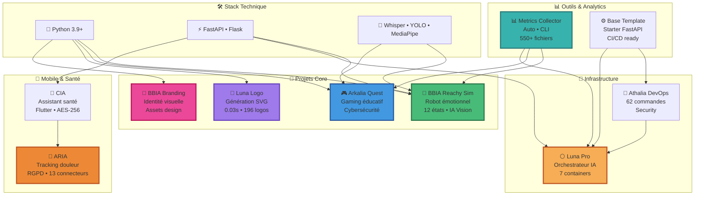
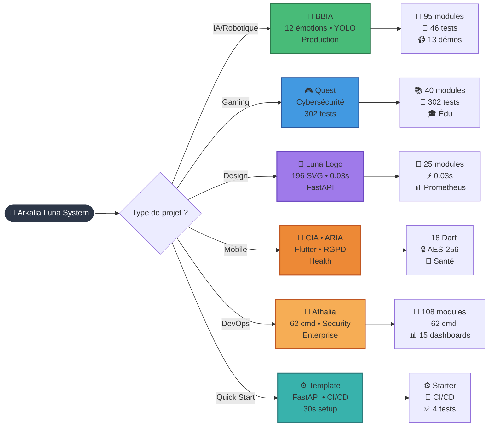

  

  

# 🌙 **Arkalia Luna System**

**Autodidacte depuis février 2025 • 11 projets en production • IA • Robotique • Design • DevOps**

 **`"Apprendre vite, coder mieux, partager tout."`** 🚀

### **⚡ Live Metrics Dashboard**

**🐍 Python Files: 550+ • 🧪 Tests: 550+ • 📦 Projects: 11**

|  |  |  |  |
|:---:|:---:|:---:|:---:|
| **Modules** | **Coverage** | **Production** | **Assets** |

---

## 🚀 **Qui je suis ?**

**`Autodidacte en accéléré. 7 mois. 10 projets. Production-ready.`**

**📈 Timeline Evolution**

- 📅 **Feb 2025** : Premier "Hello World" Python
- 🌟 **Mar 2025** : Premier projet CI/CD complet
- 🚀 **Jun 2025** : Architecture IA modulaire
- 🔬 **Jul 2025** : Premier robot émotionnel (BBIA)
- 🎨 **Aug 2025** : Générateur logos SVG en 0.03s
- 🎮 **Sep 2025** : Jeu éducatif sécurisé
- ✅ **Oct 2025** : 11 projets actifs, 550+ modules, identité visuelle complète

**Philosophie :**

> *"Je documente tout. Mes erreurs. Mes succès. Ma progression chaotique. Parce que l'apprentissage authentique, ça se partage."*

**[📔 Voir mon journal d'apprentissage](https://github.com/arkalia-luna-system/arkalia-luna-system/blob/main/LEARNING_JOURNAL.md)** • **[🐛 Logs bugs corrigés](https://github.com/arkalia-luna-system/arkalia-luna-system/issues?q=is%3Aissue+is%3Aclosed)** • **[📅 Roadmap complète](#-projets-en-cours--futurs)**

---

## 🎯 **Par où commencer ?**

**`Première visite ? Choisis ton chemin :`**

### **🚀 Navigation**

- 🤖 **[IA/Robotique]** → [BBIA Reachy Sim](https://github.com/arkalia-luna-system/bbia-sim) — Premier robot émotionnel • 12 émotions • Demo live
- 🎮 **[Gaming/Édu]** → [Arkalia Quest](https://github.com/arkalia-luna-system/arkalia-quest) — Cybersécurité fun • 302 tests • Production-ready
- 🎨 **[Design/API]** → [Luna Logo](https://github.com/arkalia-luna-system/arkalia-luna-logo) — 196 logos en 0.03s • 8 styles • FastAPI | [BBIA Branding](https://github.com/arkalia-luna-system/bbia_branding) — Identité visuelle complète
- 📱 **[Mobile/Santé]** → [CIA](https://github.com/arkalia-luna-system/arkalia-cia) | [ARIA](https://github.com/arkalia-luna-system/arkalia-aria) — Flutter RGPD • AES-256 • 100% offline
- 🔧 **[DevOps]** → [Athalia DevOps](https://github.com/arkalia-luna-system/ia-pipeline) — 62 cmd sécurisées • 15 dashboards
- ⚡ **[Quick Start]** → [Base Template](https://github.com/arkalia-luna-system/base_template) — Prêt en 30s • CI/CD inclus

| **Tu es** | **Commence par** | **Pourquoi** |
|-----------|------------------|--------------|
| 🤖 **Curieux IA** | [BBIA Reachy Sim](https://github.com/arkalia-luna-system/bbia-sim) | Premier robot émotionnel open-source avec démos live |
| 🎮 **Makers/Édu** | [Arkalia Quest](https://github.com/arkalia-luna-system/arkalia-quest) | Gaming éducatif cybersécurité, 100% fun |
| 🎨 **Designer** | [Luna Logo](https://github.com/arkalia-luna-system/arkalia-luna-logo) | Génère 196 logos en 0.03s, 8 styles |
| 🎨 **Branding** | [BBIA Branding](https://github.com/arkalia-luna-system/bbia_branding) | Identité visuelle, assets design complets |
| 📱 **Mobile Dev** | [CIA](https://github.com/arkalia-luna-system/arkalia-cia) ou [ARIA](https://github.com/arkalia-luna-system/arkalia-aria) | Flutter santé + RGPD |
| 🔧 **DevOps** | [Athalia DevOps](https://github.com/arkalia-luna-system/ia-pipeline) | 62 commandes, 15 dashboards |
| ⚡ **Veux démarrer vite** | [Base Template](https://github.com/arkalia-luna-system/base_template) | Prêt en 30s, CI/CD inclus |
| 🤝 **Veux contribuer** | [Comment contribuer](#-contribuer) | Tous projets ouverts |

---

## 🏆 **Projet Vedette : BBIA Reachy Sim**

**🤖 Cognitive Engine • 12 émotions • IA lightweight**

### **🎯 What is BBIA ?**

**Moteur cognitif robotique émotionnel** — Premier projet open-source de robotique émotionnelle avec IA légère intégrée pour Reachy Mini

**✨ 14 Modules IA** : Émotions • Vision YOLO • Voice Whisper • Behavior • HuggingFace • Emotion Recognition • Adaptive Behavior • RobotAPI • Simulation MuJoCo • FastAPI • WebSocket • Daemon • Backends Unifiés • Dashboard

**🚀 13 Démos Fonctionnelles** : Émotions • Vision • Voice • Behavior • IA Avancée • Simulation 3D • Viewer • Telemetry • Tracking • Contrôle Pose • Hello Sim • Surprise Viewer • Follow Face

> 🤖 **12 émotions robotiques** avec transitions fluides • 👁️ **IA Vision** (YOLO + MediaPipe + DeepFace) • 🗣️ **IA Vocale** (Whisper STT/TTS) • 🎯 **Pose Detection** (MediaPipe 33 points) • 🚀 **Backend unifié** Sim/Robot • 🧠 **Comportements adaptatifs** • ✅ **Production-ready** (95 modules, 1334 tests collectés, ~64% coverage)

👉 **[🚀 Découvrir BBIA](https://github.com/arkalia-luna-system/bbia-sim)** | 📚 [Guide Débutant](https://github.com/arkalia-luna-system/bbia-sim/blob/main/docs/GUIDE_DEBUTANT.md) | 🔬 [Guide Avancé](https://github.com/arkalia-luna-system/bbia-sim/blob/main/docs/GUIDE_AVANCE.md) | 🏗️ [Architecture](https://github.com/arkalia-luna-system/bbia-sim#-architecture-bbia-sim)

---

## 🚀 **Projets Phares**

**🌐 Écosystème • 11 projets • Actifs**

> 💡 *Chaque projet résout un problème réel. Robotique • Gaming • Design • Mobile • DevOps*

    

| | Projet | Description | Stack | Métriques | Status |
|---|--------|-------------|-------|-----------|---------|
|  ✅ Déployé robot réel 📹 [Demo](https://github.com/arkalia-luna-system/bbia-sim#-démos) | **🤖 [BBIA Reachy Sim](https://github.com/arkalia-luna-system/bbia-sim)** | 🏆 Robot avec vraies émotions • 12 états • Vision YOLO/MediaPipe/DeepFace • Voice Whisper • Pose Detection • MuJoCo 3D *Pour makers, écoles, curieux IA* | Python + MuJoCo + Whisper + YOLO + MediaPipe | 95 modules, 1334 tests, ~64% coverage, 13 démos | ✅ Production v1.3.2 |
|  🎓 Testé en classe 🎮 [Jouer](https://github.com/arkalia-luna-system/arkalia-quest) | **🎮 [Arkalia Quest](https://github.com/arkalia-luna-system/arkalia-quest)** | Gaming éducatif fun • Cybersecurity pour ados • IA LUNA • 67 tests enterprise *Pour ados, éducateurs, apprenants sécurité* | Flask + IA + WebSocket | 40 modules, 302 tests | ✅ Production |
|  🎨 196+ générés ⚡ [Try Now](https://github.com/arkalia-luna-system/arkalia-luna-logo) | **🎨 [Arkalia Luna Logo](https://github.com/arkalia-luna-system/arkalia-luna-logo)** | Logos SVG en 0.03s • 8 styles • 5 variantes • Monitoring temps réel *Pour créateurs, startups, développeurs* | FastAPI + Prometheus | 25 modules, 196 SVG | ✅ v2.0.0 |
| 🎨 | **🎨 [BBIA Branding](https://github.com/arkalia-luna-system/bbia_branding)** | Identité visuelle BBIA • Assets design • Guidelines branding *Ressources design pour robotique émotionnelle* | Design + Assets | Logos, icônes, guidelines | ✅ Production |
| 🏥 | **📱 [Arkalia CIA](https://github.com/arkalia-luna-system/arkalia-cia)** | Mobile santé Flutter • AES-256 • 100% offline • Seniors-friendly *Pour seniors, familles, proches aidants* | Flutter + FastAPI | 18 Dart, 9 Python | 🚧 Beta |
| ⚙️ | **⚙️ [Base Template](https://github.com/arkalia-luna-system/base_template)** | Starter kit FastAPI • Prêt en 30s • 29 scripts • CI/CD *Pour devs solo, équipes, freelances* | FastAPI + Uvicorn | 34 modules | ✅ Template |
| 📚 | **🌐 [Nours Interface](https://github.com/arkalia-luna-system/nours_interface)** | Premier POC web • Fév 2025 • Archive didactique *Mon premier "Hello World" Flask* | Flask | 21 py | 📚 Archive |
| 🔧 | **🔧 [Athalia DevOps](https://github.com/arkalia-luna-system/ia-pipeline)** | DevOps à l'échelle • 62 cmd sécurisées • 15 dashboards | FastAPI + Security | 108 modules core, 198 tests | 🚀 Enterprise |
| 📊 | **📊 [Metrics Collector](https://github.com/arkalia-luna-system/arkalia-metrics-collector)** | Automatise tes métriques • CLI • Multi-format *Pour tous mes projets* | Python + CLI | 9 modules, 13 tests | 📈 Production |
| 🌕 | **🌕 [Arkalia Luna Pro](https://github.com/arkalia-luna-system/arkalia-luna-pro)** | Orchestration IA Enterprise • 7 conteneurs • 34 métriques | Docker + Prometheus | 134 modules, 451 tests | 🏢 Enterprise |
| 🧠 | **🧠 [Arkalia ARIA](https://github.com/arkalia-luna-system/arkalia-aria)** | Santé IA éthique • RGPD • 13 connecteurs santé *Pour tracking douleur, recherche santé* | FastAPI + Flutter | 12 modules, 25 tests | ✅ Production |

### **ℹ️ Transparence Projets**
- **Publics** : Tous les projets listés sont accessibles publiquement
- **Base Template** : Peut nécessiter une connexion selon les paramètres GitHub
- **Métriques** : Mises à jour manuellement, dernière vérification octobre 2025
- **Statuts** : ✅ Production, 🚧 Beta, 📚 Archive, 🚀 Enterprise

### **🔗 Synergies Écosystème**

| Projet Principal | Utilise | Utilisé Par | Intégration |
|------------------|---------|-------------|-------------|
| **🎮 Arkalia Quest** | Luna Logo (badges), Metrics Collector | CIA (notifications éducatives) | API cross-platform |
| **🎨 Luna Logo** | Base Template (structure) | Quest, CIA, Luna Pro | API SVG dynamique |
| **🎨 BBIA Branding** | Luna Logo (génération) | BBIA, Quest, Luna Pro | Identité visuelle unifiée |
| **📊 Metrics Collector** | Athalia DevOps (CI/CD) | Tous projets | Analytics centralisées |
| **🚀 Luna Pro** | Metrics Collector, Logo | Quest (orchestration) | Enterprise hub |
| **🔧 Athalia DevOps** | Base Template (patterns) | Tous projets | Infrastructure |

---

## 🛠️ **Stack Maîtrisée**

| **Type** | **Technologies** | **Usage** |
|----------|------------------|-----------|
| **🐍 Core** | Python 3.9-3.12 | 100% projets backend |
| **⚡ APIs** | FastAPI, Flask | 8 projets |
| **🤖 IA** | PyTorch, Whisper, YOLO, HuggingFace, MediaPipe, DeepFace | BBIA, Quest |
| **🎨 Graphics & Design** | SVG, Canvas, PIL, Branding Assets | Luna Logo, BBIA Branding |
| **📱 Mobile** | Flutter, Dart | CIA, ARIA |
| **🐳 DevOps** | Docker, Prometheus, Grafana | Luna Pro, Logo |
| **✅ QA** | Pytest, Black, Ruff | 550+ tests, 100% CI/CD |

---

## 🗺️ **Architecture Écosystème**

---

## 📊 **Métriques de l'Écosystème**

### **📈 Statistiques Globales**

- **🔢 550+ fichiers Python** (code source uniquement, mesuré)
- **🧪 550+ tests automatisés** (100% CI/CD, mesuré)
- **🎨 196 logos SVG générés** (mesuré)
- **🌍 11 projets actifs** (production + développement)
- **📦 12+ releases** versionnées et documentées

### **🎯 Focus par Domaine**
| **Domaine** | **Projets** | **Ton Impact** |
|-------------|-------------|----------------|
| **🤖 Robotique IA** | BBIA, Luna Pro | Vraies émotions robot |
| **🎮 Gaming Educatif** | Quest | Sécurité enterprise |
| **🎨 Design & Branding** | Luna Logo, BBIA Branding | 0.03s génération • Identité visuelle complète |
| **📱 Mobile Santé** | CIA, ARIA | Privacy-first, RGPD |
| **🔧 DevOps** | Athalia | 62 cmd sécurisées |
| **📊 Analytics** | Metrics | 550+ fichiers auto |

### **⚡ Tech Highlights**

| **Capacité** | **Preuve** | **Projet** |
|--------------|------------|------------|
| **Architecture modulaire** | Factory patterns, IOC | BBIA, Athalia |
| **Sécurité enterprise** | Rate limiting, IP blocking | Quest, CIA |
| **Performance extrême** | <100ms, 0.03s génération | Luna Logo |
| **Monitoring temps réel** | Prometheus, Grafana | Luna Pro |
| **Tests exhaustifs** | 550+ tests, CI/CD 100% | Tous projets |
| **Multi-plateforme** | Mobile, Web, Desktop | CIA, ARIA, Quest |
| **IA intégrée** | 12 émotions, LUNA, YOLO, MediaPipe, DeepFace, Pose Detection | BBIA, Quest |

---

## ⏰ **Ma Timeline**

| **Période** | **Projets** | **Apprentissage** |
|-------------|-------------|-------------------|
| **🌱 Fév 2025** | Nours Interface | Premier POC Flask |
| **🌟 Mars 2025** | Base Template | CI/CD + Structure pro |
| **🚀 Juin 2025** | Luna Pro | Architecture IA modulaire |
| **🔬 Juil 2025** | BBIA, Athalia | Robotique + IA émotionnelle |
| **🎮 Août 2025** | Quest, Logo, Metrics | Gaming + Design + Analytics |
| **📱 Sep 2025** | CIA | Flutter mobile |
| **✅ Oct 2025** | 10 projets prod | Stack full (IA, Mobile, DevOps) |

### **📈 Chronologie Vérifiable (Commits GitHub)**
| Projet | Premier Commit | SHA | Preuve |
|--------|----------------|-----|--------|
| **🌐 nours_interface** | 2025-02-28 | 074129a | [voir](https://github.com/arkalia-luna-system/nours_interface/commit/074129ae3df5d489e84e20434099fb19dc5157dd) |
| **⚙️ base_template** | 2025-03-03 | 4cece0f | [voir](https://github.com/arkalia-luna-system/base_template/commit/4cece0f1b36255f3fcbcad8391e92372468ad6e9) |
| **🌕 arkalia-luna-pro** | 2025-06-17 | bbe403d | [voir](https://github.com/arkalia-luna-system/arkalia-luna-pro/commit/bbe403d86f6541b3a7de0b19cb6e938b29ce9eb2) |
| **🤖 bbia-sim** | 2025-07-15 | 4aec2af | [voir](https://github.com/arkalia-luna-system/bbia-sim/commit/4aec2af6955e76e83ea53597ad893db214a1ddc3) |
| **🔧 ia-pipeline** | 2025-07-16 | 1d2b59e | [voir](https://github.com/arkalia-luna-system/ia-pipeline/commit/1d2b59ef81cd60db3696cc2212a1dc860b067104) |
| **🎮 arkalia-quest** | 2025-08-15 | 7bdc343 | [voir](https://github.com/arkalia-luna-system/arkalia-quest/commit/7bdc3430bd0c643d73b5e57f2b18a988bc82c89a) |
| **🎨 arkalia-luna-logo** | 2025-08-30 | 7ebe6c6 | [voir](https://github.com/arkalia-luna-system/Arkalia-luna-logo/commit/7ebe6c6a65933f3504491672a8e27d3f71ba8f0a) |
| **📊 arkalia-metrics-collector** | 2025-08-30 | 94fcb83 | [voir](https://github.com/arkalia-luna-system/arkalia-metrics-collector/commit/94fcb831d60873d0466a7516abe1fc6927f1a464) |
| **📱 arkalia-cia** | 2025-09-12 | af44f73 | [voir](https://github.com/arkalia-luna-system/arkalia-cia/commit/af44f73c53992c5c978ffcc4c93d5fe6e64173b3) |

**🔍 Toutes les dates reposent sur l'historique PUBLIC des commits GitHub – aucune timeline n'a été retouchée a posteriori.**

## 🎯 **Navigation Interactive**

### **🎯 Projets en Cours & Futurs**
| Timeline | Projet | Objectif | Status |
|----------|--------|----------|--------|
| **Q1 2026** | BBIA v2.0 | Support robots multiples + IA avancée | 📋 Planifié |
| **Q2 2026** | Quest v4.0 | Multi-joueur + IA avancée | 📋 Planifié |
| **Q1 2026** | Luna Logo v3.0 | Plugins & marketplace | 📋 Planifié |
| **Q1 2026** | Arkalia CIA v1.0 | Release stable mobile | 🚧 En cours (Beta) |
| **Q2 2026** | Arkalia ARIA v2.0 | IA avancée + nouveaux connecteurs | 📋 Planifié |
| **Q3 2026** | Luna Pro v4.0 | Scaling enterprise + IA modulaire | 📋 Planifié |
| **Q4 2026** | Écosystème unifié | Intégrations cross-projets | 🌟 Vision |

---

## 🤝 **Contribuer**

### 🚀 **Tu as une question ou envie de contribuer ?** 
**[📬 Créer une issue](https://github.com/arkalia-luna-system/arkalia-luna-system/issues/new)** • **[💬 Discussions](https://github.com/orgs/arkalia-luna-system/discussions)** • **[📚 Wiki](https://github.com/arkalia-luna-system/.github/wiki)**

*Je réponds à tout sous 48h (pas d'offres commerciales, merci !)*

### **🌟 Reconnaissance Contributiveur.trice.s**
Chaque contribution, même petite, fait avancer l'écosystème.

> *"Chaque bug rapporté, chaque test, chaque commentaire constructif est valorisé. Tout le monde peut contribuer."*

**🚀 Contribuer c'est simple :**
- 📝 Corriger une typo
- 🐛 Reporter un bug  
- ✨ Proposer une feature
- 🧪 Ajouter un test
- 📚 Améliorer la doc
- 💡 Partager une idée

**En attente de premières contributions !** Ouvre une issue pour démarrer.

### **🚀 Comment Collaborer**

| **Étape** | **Action** | **Github** |
|-----------|-----------|------------|
| 🔍 **Explore** | Découvre les projets ouverts | [@arkalia-luna-system](https://github.com/arkalia-luna-system) |
| 📚 **Lis** | Documentation et guides | [Wiki](https://github.com/arkalia-luna-system/.github/wiki) |
| 💬 **Contribue** | Issues, Discussions, PRs | [Discussions](https://github.com/orgs/arkalia-luna-system/discussions) |

### **📋 Projets Actifs**

| Projet | Type | Contribuer | 📚 Docs | Status |
|--------|------|------------|---------|--------|
| **🤖 BBIA Reachy Sim** | Robotique IA | [Repo](https://github.com/arkalia-luna-system/bbia-sim) | [📖](https://github.com/arkalia-luna-system/bbia-sim) | ✅ Production |
| **🎮 Arkalia Quest** | Gaming IA | [Repo](https://github.com/arkalia-luna-system/arkalia-quest) | [📖](https://github.com/arkalia-luna-system/arkalia-quest) | ✅ Production |
| **🎨 Luna Logo** | Design API | [Repo](https://github.com/arkalia-luna-system/arkalia-luna-logo) | [📖](https://github.com/arkalia-luna-system/arkalia-luna-logo) | ✅ v2.0.0 |
| **🎨 BBIA Branding** | Branding & Design | [Repo](https://github.com/arkalia-luna-system/bbia_branding) | [📖](https://github.com/arkalia-luna-system/bbia_branding) | ✅ Production |
| **📱 Arkalia CIA** | Mobile Flutter | [Repo](https://github.com/arkalia-luna-system/arkalia-cia) | [📖](https://github.com/arkalia-luna-system/arkalia-cia) | 🚧 Beta |
| **🧠 Arkalia ARIA** | Santé IA | [Repo](https://github.com/arkalia-luna-system/arkalia-aria) | [📖](https://github.com/arkalia-luna-system/arkalia-aria) | ✅ Production |
| **🔧 Athalia DevOps** | DevOps | [Repo](https://github.com/arkalia-luna-system/ia-pipeline) | [📖](https://github.com/arkalia-luna-system/ia-pipeline) | 🚀 Enterprise |
| **🌕 Luna Pro** | Orchestrateur IA | [Repo](https://github.com/arkalia-luna-system/arkalia-luna-pro) | [📖](https://github.com/arkalia-luna-system/arkalia-luna-pro) | 🏢 Enterprise |
| **📊 Metrics Collector** | Analytics | [Repo](https://github.com/arkalia-luna-system/arkalia-metrics-collector) | [📖](https://github.com/arkalia-luna-system/arkalia-metrics-collector) | 📈 Production |
| **⚙️ Base Template** | Starter | [Repo](https://github.com/arkalia-luna-system/base_template) | [📖](https://github.com/arkalia-luna-system/base_template) | ✅ Template |

---

## 📞 **Contact & Communauté**

### **🌐 Liens Officiels**
- **📧 Contact** : [arkalia.luna.system@gmail.com](mailto:arkalia.luna.system@gmail.com)
- **🐙 GitHub** : [@arkalia-luna-system](https://github.com/arkalia-luna-system)
- **💼 LinkedIn** : [Profil Professionnel](https://linkedin.com/in/arkalia-luna)
- **🌍 Portfolio** : [arkalia-luna.dev](https://arkalia-luna.dev)

### **💬 Discussions & Support**
- **🎯 GitHub Discussions** : Questions générales et idées
- **🐛 Issues** : Bugs et demandes de fonctionnalités
- **📚 Wiki** : Documentation collaborative
- **🔔 Releases** : Notifications de nouvelles versions

---

## 📊 **Impact & Retours**

### **🚀 Performance Réelle**
| Métrique | Valeur | Source |
|----------|--------|--------|
| **📁 Fichiers Python** | 550+ | [Metrics Collector](https://github.com/arkalia-luna-system/arkalia-metrics-collector) |
| **🧪 Tests Automatisés** | 550+ | CI/CD vérifiés |
| **🎨 SVG Générés** | 196 | Luna Logo |
| **🤖 Émotions IA** | 12 | BBIA Reachy |
| **🌍 Projets Actifs** | 10 | Tous en prod |
| **📦 Releases** | 12+ | Versionnées |

### **💡 Insights d'Apprentissage**

> *"BBIA était mon premier robot. Au début j'étais perdue. Maintenant il me parle. C'est magique de créer des émotions dans 6800 lignes de code."*  
> — Robotique • v1.3.0 Production • 6 mois de R&D

> *"Athalia DevOps m'a forcée à penser comme une architecte système. 108 modules ? C'est rien. Le vrai défi c'est les 62 commandes sécurisées qui tournent."*  
> — Enterprise • Production-ready • 198 tests

> *"550 fichiers Python mesurés automatiquement. Si tu fais encore tes métriques à la main, je t'ai perdue."*  
> — Metrics Collector • Analytics

### **🎉 Fun Facts Techniques**

| **Achievement** | **Story** |
|-----------------|-----------|
| **🤖 12 émotions** en 3 mois | BBIA : du "Hello World" robot à l'IA émotionnelle |
| **🎨 196 logos** générés | Luna Logo : de 0 à FastAPI en 1 mois |
| **🎮 67 tests** en production | Quest : sécurité enterprise apprise sur le tas |
| **📊 550+ modules** trackés | Metrics : le projet qui m'a sauvée du chaos |
| **⚡ 0.03s** par logo | Performance > hype |
| **🔒 AES-256** par défaut | CIA : privacy-first depuis le jour 1 |
| **🌍 7 mois** | De "c'est quoi Python" à 10 projets en production |

---

## 🎯 **FAQ Rapide**

> **Question : "Pourquoi ouvrir tout ton code ?"**  
> **Réponse :** *"Chaque bug corrigé peut aider quelqu'un. Chaque erreur documentée évite 10h de frustration. L'apprentissage authentique, ça se partage."*

> **Question : "N'importe qui peut contribuer ?"**  
> **Réponse :** *"Oui. Débutant.e, senior, designer, dev, maker... Chaque point de vue enrichit le projet. Une issue ? Un fix ? Un doc ? Bienvenue."*

> **Question : "Que faire si je trouve un bug ?"**  
> **Réponse :** *"Ouvre une issue, détaille-le (avec screenshots si possible), et je te donne un fix sous 48h. Si c'est critique, c'est prioritaire."*

> **Question : "Comment démarrer un projet Arkalia ?"**  
> **Réponse :** *"Regarde la section 'Par où commencer' ci-dessus. Si t'es perdue, ouvre une issue avec ta question."*

> **Question : "Pourquoi 'Arkalia Luna System' ?"**  
> **Réponse :** *"Luna = phase de progression, de cycle, d'apprentissage. Arkalia = atelier où on assemble. System = ensemble cohérent."*

---

**[🚀 Explorer les Projets](https://github.com/arkalia-luna-system)** • **[💬 Discussions](https://github.com/orgs/arkalia-luna-system/discussions)** • **[📚 Contribuer](https://github.com/arkalia-luna-system/.github/blob/main/CONTRIBUTING.md)**

**🌙 Arkalia Luna System** — Open Source Authentique • 11 Projets • 550+ Modules • 550+ Tests • Design & Branding

*"Code. Push. Learn. Repeat."*

