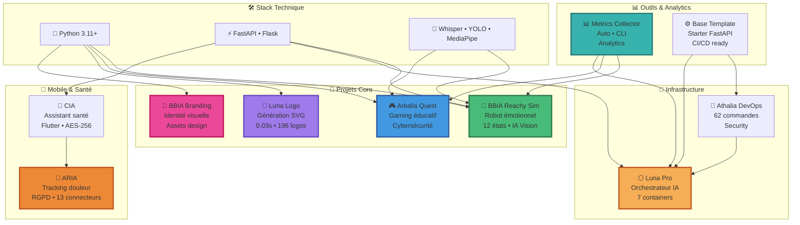

# 🌙 **Arkalia Luna System**

**Développeur Full-Stack • 11 projets en production • IA • Robotique • Design • DevOps**

**`"Construire des systèmes qui comptent."`**

### Métriques

**Python Files: 550+ • Tests: 550+ • Projects: 11**

|  |  |  |  |
|:---:|:---:|:---:|:---:|
| **Modules** | **Coverage** | **Production** | **Assets** |

### Statistiques GitHub

### Trophées GitHub

**Stack Technique :**     

---

## Projet Principal : BBIA Reachy Sim

**Cognitive Engine • 12 émotions • IA lightweight**

*Robot émotionnel open-source avec moteur cognitif et expression d'émotions*

**Écosystème Luna :** [Luna Logo Generator](https://github.com/arkalia-luna-system/arkalia-luna-logo) — 196 logos SVG générés

**Points Clés :**
- **12 émotions robotiques** avec transitions fluides
- **IA Vision** (YOLO + MediaPipe + DeepFace)
- **IA Vocale** (Whisper STT/TTS)
- **Pose Detection** (MediaPipe 33 points)
- **Backend unifié** Sim/Robot
- **Production-ready** (95 modules, 1334 tests, ~64% coverage)

**[Découvrir BBIA](https://github.com/arkalia-luna-system/bbia-sim)** | [Documentation](https://github.com/arkalia-luna-system/bbia-sim/blob/main/docs/GUIDE_DEBUTANT.md) | [Guide Technique](https://github.com/arkalia-luna-system/bbia-sim/blob/main/docs/GUIDE_AVANCE.md) | [Architecture](https://github.com/arkalia-luna-system/bbia-sim#-architecture-bbia-sim)

## Navigation Rapide

- **[IA/Robotique](https://github.com/arkalia-luna-system/bbia-sim)** — BBIA Reachy Sim : Robot émotionnel • 12 émotions
- **[Gaming](https://github.com/arkalia-luna-system/arkalia-quest)** — Arkalia Quest : Cybersécurité éducative
- **[Design](https://github.com/arkalia-luna-system/arkalia-luna-logo)** — Luna Logo | [BBIA Branding](https://github.com/arkalia-luna-system/bbia_branding)
- **[Mobile](https://github.com/arkalia-luna-system/arkalia-cia)** — CIA | [ARIA](https://github.com/arkalia-luna-system/arkalia-aria)
- **[DevOps](https://github.com/arkalia-luna-system/ia-pipeline)** — Athalia DevOps | [Base Template](https://github.com/arkalia-luna-system/base_template)

---

## Projets Phares

**Écosystème actif** — Chaque projet résout un problème réel : Robotique • Gaming • Design • Mobile • DevOps

### **🌟 Projets Principaux**

<table>
<tr>
<td align="center" width="33%">
<a href="https://github.com/arkalia-luna-system/bbia-sim">

 <strong>BBIA Sim</strong>
 Robot émotionnel
</a>
</td>
<td align="center" width="33%">
<a href="https://github.com/arkalia-luna-system/bbia_branding">

 <strong>BBIA Branding</strong>
 Identité visuelle
</a>
</td>
<td align="center" width="33%">
<a href="https://github.com/arkalia-luna-system/arkalia-luna-logo">

 <strong>Luna Logo</strong>
 Générateur SVG
</a>
</td>
</tr>
</table>

### Tous les Projets

| Projet | Description | Stack | Status |
|--------|-------------|-------|--------|
| **[BBIA Reachy Sim](https://github.com/arkalia-luna-system/bbia-sim)** | Robot émotionnel • 12 émotions • IA Vision | Python + MuJoCo | ✅ Production |
| **[BBIA Branding](https://github.com/arkalia-luna-system/bbia_branding)** | Identité visuelle complète • Assets design | Design | ✅ Production |
| **[Luna Logo](https://github.com/arkalia-luna-system/arkalia-luna-logo)** | Générateur logos SVG • 8 styles × 5 variantes | FastAPI + Docker | ✅ v2.0.0 |
| **[Arkalia Quest](https://github.com/arkalia-luna-system/arkalia-quest)** | Gaming éducatif cybersécurité | Flask + IA | ✅ Production |
| **[Arkalia CIA](https://github.com/arkalia-luna-system/arkalia-cia)** | Mobile santé Flutter • AES-256 | Flutter | 🚧 Beta |
| **[Arkalia ARIA](https://github.com/arkalia-luna-system/arkalia-aria)** | Santé IA éthique • RGPD | FastAPI + Flutter | ✅ Production |
| **[Base Template](https://github.com/arkalia-luna-system/base_template)** | Starter FastAPI • CI/CD | FastAPI | ✅ Template |
| **[Athalia DevOps](https://github.com/arkalia-luna-system/ia-pipeline)** | DevOps • 62 cmd sécurisées | FastAPI | 🚀 Enterprise |
| **[Metrics Collector](https://github.com/arkalia-luna-system/arkalia-metrics-collector)** | Analytics centralisées | Python + CLI | 📈 Production |
| **[Luna Pro](https://github.com/arkalia-luna-system/arkalia-luna-pro)** | Orchestration IA Enterprise | Docker | 🏢 Enterprise |

**Notes :** Tous les projets sont publics. Statuts : ✅ Production, 🚧 Beta, 🚀 Enterprise, ✅ Template

---

## Stack Technique

| Type | Technologies | Usage |
|------|--------------|-------|
| **Core** | Python 3.11-3.12 | 100% projets backend |
| **APIs** | FastAPI, Flask | 8 projets |
| **IA** | PyTorch, Whisper, YOLO, HuggingFace, MediaPipe, DeepFace | BBIA, Quest |
| **Graphics & Design** | SVG, Canvas, PIL, Branding Assets | Luna Logo, BBIA Branding |
| **Mobile** | Flutter, Dart | CIA, ARIA |
| **DevOps** | Docker, Prometheus, Grafana | Luna Pro, Logo |
| **QA** | Pytest, Black, Ruff | Tests automatisés, 100% CI/CD |

---

## Architecture Écosystème

  

---

## Métriques de l'Écosystème

<!-- AUTO-UPDATE:stats -->
### Statistiques

- **Projets** : 11 en production
- **Langages** : Python (9), Shell (1), HTML (1)

*Dernière mise à jour : 2025-11-10*
<!-- AUTO-UPDATE:languages -->

### Roadmap

| Timeline | Projet | Objectif | Status |
|----------|--------|----------|--------|
| **Q1 2026** | BBIA v2.0 | Robots multiples + IA avancée | 📋 Planifié |
| **Q1 2026** | Luna Logo v3.0 | Plugins & marketplace | 📋 Planifié |
| **Q1 2026** | Arkalia CIA v1.0 | Release stable mobile | 🚧 En cours |
| **Q2 2026** | Quest v4.0 | Multi-joueur + IA avancée | 📋 Planifié |
| **Q2 2026** | Arkalia ARIA v2.0 | IA avancée + connecteurs | 📋 Planifié |
| **Q3 2026** | Luna Pro v4.0 | Scaling enterprise | 📋 Planifié |
| **Q4 2026** | Écosystème unifié | Intégrations cross-projets | 🌟 Vision |

---

## Contribuer

**[Créer une issue](https://github.com/arkalia-luna-system/arkalia-luna-system/issues/new)** | **[Discussions](https://github.com/orgs/arkalia-luna-system/discussions)** | **[Wiki](https://github.com/arkalia-luna-system/arkalia-luna-system/wiki)**

**Comment contribuer :** Corriger une typo • Reporter un bug • Proposer une feature • Ajouter un test • Améliorer la doc

**Ressources :** [Wiki](https://github.com/arkalia-luna-system/arkalia-luna-system/wiki) | [Discussions](https://github.com/orgs/arkalia-luna-system/discussions) | [@arkalia-luna-system](https://github.com/arkalia-luna-system)

*Réponse sous 48h pour les questions techniques et contributions. Tous les projets sont ouverts aux contributions.*

---

## Contact

**Email** : [arkalia.luna.system@gmail.com](mailto:arkalia.luna.system@gmail.com) | **GitHub** : [@arkalia-luna-system](https://github.com/arkalia-luna-system) | **LinkedIn** : [Profil](https://linkedin.com/in/arkalia-luna) | **Portfolio** : [arkalia-luna.dev](https://arkalia-luna.dev)

---

## Impact & Performance

| Métrique | Valeur |
|----------|--------|
| **Fichiers Python** | 550+ |
| **Tests Automatisés** | 550+ |
| **SVG Générés** | 196 |
| **Émotions IA** | 12 |
| **Projets** | 11 |
| **Releases** | 12+ |

---

## FAQ

**Q: Pourquoi ouvrir tout le code ?**  
A: *Chaque bug corrigé peut aider quelqu'un. L'apprentissage authentique, ça se partage.*

**Q: Qui peut contribuer ?**  
A: *Oui. Débutant.e, senior, designer, dev, maker... Chaque point de vue enrichit le projet.*

**Q: Que faire si je trouve un bug ?**  
A: *Ouvre une issue avec détails (screenshots si possible). Fix sous 48h si critique.*

**Q: Comment démarrer ?**  
A: *Consultez la section [Navigation Rapide](#-navigation-rapide) ci-dessus.*

---

**[Explorer les Projets](https://github.com/arkalia-luna-system)** | **[Discussions](https://github.com/orgs/arkalia-luna-system/discussions)** | **[Contribuer](https://github.com/arkalia-luna-system/arkalia-luna-system/blob/main/CONTRIBUTING.md)**

**Arkalia Luna System** — Open Source • 11 Projets • 550+ Modules • Design & Branding

*"Build. Ship. Iterate."*

 

