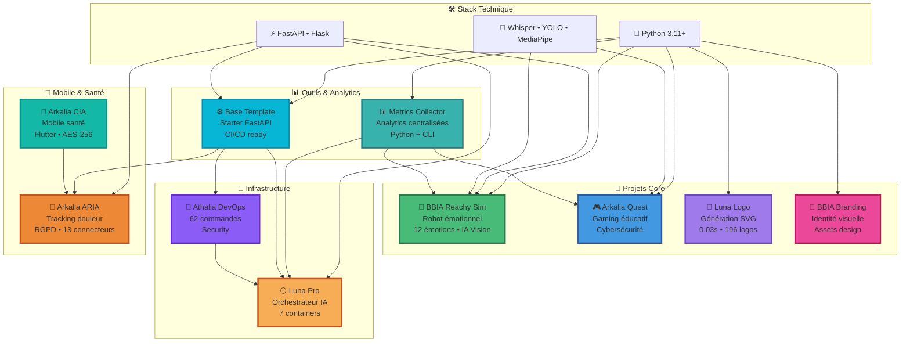

# 🌙 Arkalia Luna System

**Développeur Full-Stack • 11 projets en production • IA • Robotique • Design • DevOps**

<code style="background: rgba(20, 184, 166, 0.1); padding: 6px 14px; border-radius: 8px; font-size: 0.95em; border: 1px solid rgba(20, 184, 166, 0.3);">"Construire des systèmes qui comptent."</code>

 

### ⚡ Métriques Clés

|  |  |  |  |
|:---:|:---:|:---:|:---:|
| **550+ modules** | **~64% coverage** | **11 projets** | **196 SVG** |

 

**Stack Technique**

---

## 🤖 Projet Principal : BBIA Reachy Sim

**Cognitive Engine • 12 émotions • IA lightweight**

*Robot émotionnel open-source avec moteur cognitif et expression d'émotions*

 

**Points Clés**

| **Fonctionnalité** | **Technologie** |
|:------------------:|:---------------:|
| 🤖 **12 émotions robotiques** | Transitions fluides |
| 👁️ **IA Vision** | YOLO + MediaPipe + DeepFace |
| 🗣️ **IA Vocale** | Whisper STT/TTS |
| 🎯 **Pose Detection** | MediaPipe 33 points |
| 🚀 **Backend unifié** | Sim/Robot |
| ✅ **Production-ready** | 95 modules, 1334 tests, ~64% coverage |

**[Découvrir BBIA](https://github.com/arkalia-luna-system/bbia-sim)** • [Documentation](https://github.com/arkalia-luna-system/bbia-sim/blob/main/docs/GUIDE_DEBUTANT.md) • [Architecture](https://github.com/arkalia-luna-system/bbia-sim#-architecture-bbia-sim)

---

## 🚀 Projets Phares

**Écosystème actif** — Chaque projet résout un problème réel : Robotique • Gaming • Design • Mobile • DevOps

 

### 🌟 Projets Principaux

<table>
<tr>
<td align="center" width="33%">
<a href="https://github.com/arkalia-luna-system/bbia-sim">

  
<strong>BBIA Sim</strong>
 
Robot émotionnel
</a>
</td>
<td align="center" width="33%">
<a href="https://github.com/arkalia-luna-system/bbia_branding">

  
<strong>BBIA Branding</strong>
 
Identité visuelle
</a>
</td>
<td align="center" width="33%">
<a href="https://github.com/arkalia-luna-system/arkalia-luna-logo">

  
<strong>Luna Logo</strong>
 
Générateur SVG
</a>
</td>
</tr>
</table>

 

### 📋 Tous les Projets

| Projet | Description | Stack | Status |
|:------:|:-----------:|:-----:|:-----:|
| **[BBIA Reachy Sim](https://github.com/arkalia-luna-system/bbia-sim)** | Robot émotionnel • 12 émotions • IA Vision | Python + MuJoCo | ✅ Production |
| **[BBIA Branding](https://github.com/arkalia-luna-system/bbia_branding)** | Identité visuelle complète • Assets design | Design | ✅ Production |
| **[Luna Logo](https://github.com/arkalia-luna-system/arkalia-luna-logo)** | Générateur logos SVG • 8 styles × 5 variantes | FastAPI + Docker | ✅ v2.0.0 |
| **[Arkalia Quest](https://github.com/arkalia-luna-system/arkalia-quest)** | Gaming éducatif cybersécurité | Flask + IA | ✅ Production |
| **[Arkalia CIA](https://github.com/arkalia-luna-system/arkalia-cia)** | Mobile santé Flutter • AES-256 | Flutter | 🚧 Beta |
| **[Arkalia ARIA](https://github.com/arkalia-luna-system/arkalia-aria)** | Tracking douleur • Bien-être mental • 13 connecteurs • RGPD | FastAPI + Flutter | ✅ Production |
| **[Base Template](https://github.com/arkalia-luna-system/base_template)** | Starter FastAPI • CI/CD | FastAPI | ✅ Template |
| **[Athalia DevOps](https://github.com/arkalia-luna-system/ia-pipeline)** | DevOps • 62 cmd sécurisées | FastAPI | 🚀 Enterprise |
| **[Metrics Collector](https://github.com/arkalia-luna-system/arkalia-metrics-collector)** | Analytics centralisées | Python + CLI | ✅ Production |
| **[Luna Pro](https://github.com/arkalia-luna-system/arkalia-luna-pro)** | Orchestration IA Enterprise | Docker | 🏢 Enterprise |

**Note :** Tous les projets sont publics. Statuts : ✅ Production • 🚧 Beta • 🚀 Enterprise • ✅ Template

---

## 🛠️ Stack Technique

| Type | Technologies | Usage |
|:----:|:------------:|:-----:|
| **Core** | Python 3.11-3.12 | 100% projets backend |
| **APIs** | FastAPI, Flask | 8 projets |
| **IA** | PyTorch, Whisper, YOLO, HuggingFace, MediaPipe, DeepFace | BBIA, Quest |
| **Graphics & Design** | SVG, Canvas, PIL, Branding Assets | Luna Logo, BBIA Branding |
| **Mobile** | Flutter, Dart | CIA, ARIA |
| **DevOps** | Docker, Prometheus, Grafana | Luna Pro, Logo |
| **QA** | Pytest, Black, Ruff | Tests automatisés, 100% CI/CD |

---

## 🗺️ Architecture Écosystème

---

## 📊 Métriques de l'Écosystème

<!-- AUTO-UPDATE:stats -->
### 📈 Statistiques

- **Projets** : 11 en production
- **Langages** : Python (9), Shell (1), HTML (1)

*Dernière mise à jour : novembre 2025*
<!-- AUTO-UPDATE:languages -->

### 🎯 Roadmap

| Timeline | Projet | Objectif | Status |
|:--------:|:------:|:--------:|:------:|
| **Q1 2026** | BBIA v2.0 | Robots multiples + IA avancée | 📋 Planifié |
| **Q1 2026** | Luna Logo v3.0 | Plugins & marketplace | 📋 Planifié |
| **Q1 2026** | Arkalia CIA v1.0 | Release stable mobile | 🚧 En cours |
| **Q2 2026** | Quest v4.0 | Multi-joueur + IA avancée | 📋 Planifié |
| **Q2 2026** | Arkalia ARIA v2.0 | IA avancée + connecteurs | 📋 Planifié |
| **Q3 2026** | Luna Pro v4.0 | Scaling enterprise | 📋 Planifié |
| **Q4 2026** | Écosystème unifié | Intégrations cross-projets | 🌟 Vision |

---

## 🤝 Contribuer

**[Créer une issue](https://github.com/arkalia-luna-system/arkalia-luna-system/issues/new)** • **[Discussions](https://github.com/orgs/arkalia-luna-system/discussions)** • **[Wiki](https://github.com/arkalia-luna-system/arkalia-luna-system/wiki)**

**Comment contribuer :** Corriger une typo • Reporter un bug • Proposer une feature • Ajouter un test • Améliorer la doc

**Ressources :** [Wiki](https://github.com/arkalia-luna-system/arkalia-luna-system/wiki) • [Discussions](https://github.com/orgs/arkalia-luna-system/discussions) • [@arkalia-luna-system](https://github.com/arkalia-luna-system)

*Réponse rapide pour les questions techniques et contributions. Tous les projets sont ouverts aux contributions.*

---

## 📞 Contact

**Email** : [arkalia.luna.system@gmail.com](mailto:arkalia.luna.system@gmail.com)  
**GitHub** : [@arkalia-luna-system](https://github.com/arkalia-luna-system)

---

## 📊 Impact & Performance

| Métrique | Valeur | Détails |
|:--------:|:------:|:-------|
| **Couverture Tests** | ~64% | BBIA : 1334 tests, 95 modules |
| **Temps Génération** | 0.03s | Luna Logo : génération SVG |
| **Containers** | 7 | Luna Pro : orchestration complète |
| **Connecteurs** | 13 | ARIA : intégrations santé |
| **Commandes DevOps** | 62 | Athalia : pipeline sécurisé |
| **Releases** | 12+ | Versions stables déployées |

---

## 🎯 FAQ

<b>Q: Comment démarrer avec un projet ?</b>

A: *Consultez la section [Projets Phares](#-projets-phares) ci-dessus. Chaque projet a sa documentation complète dans son repository GitHub avec guides de démarrage rapide.*

<b>Q: Qui peut contribuer ?</b>

A: *Tous les contributeurs sont les bienvenus. Designer, développeur, maker... Chaque point de vue enrichit le projet.*

<b>Q: Que faire si je trouve un bug ?</b>

A: *Ouvrez une issue avec détails (screenshots si possible). Fix sous 48h si critique.*

<b>Q: Comment sont organisés les projets ?</b>

A: *L'écosystème est structuré en 4 catégories : Core (BBIA, Quest, Logo), Infrastructure (DevOps, Luna Pro), Mobile & Santé (CIA, ARIA), et Outils (Metrics, Template). Voir l'[Architecture](#-architecture-écosystème) pour plus de détails.*

<b>Q: Quelles technologies sont utilisées ?</b>

A: *Python 3.11+ pour le backend, FastAPI/Flask pour les APIs, PyTorch/Whisper/YOLO pour l'IA, Flutter pour le mobile, Docker pour l'orchestration. Voir la [Stack Technique](#-stack-technique) complète.*

---

**[Explorer les Projets](https://github.com/arkalia-luna-system)** • **[Discussions](https://github.com/orgs/arkalia-luna-system/discussions)** • **[Contribuer](https://github.com/arkalia-luna-system/arkalia-luna-system/blob/main/CONTRIBUTING.md)**

 

 

**🌙 Arkalia Luna System** — Open Source • 11 Projets • 550+ Modules • Design & Branding

<code style="background: rgba(20, 184, 166, 0.1); padding: 6px 14px; border-radius: 8px; font-size: 0.95em; border: 1px solid rgba(20, 184, 166, 0.3);">"Build. Ship. Iterate."</code>

 

