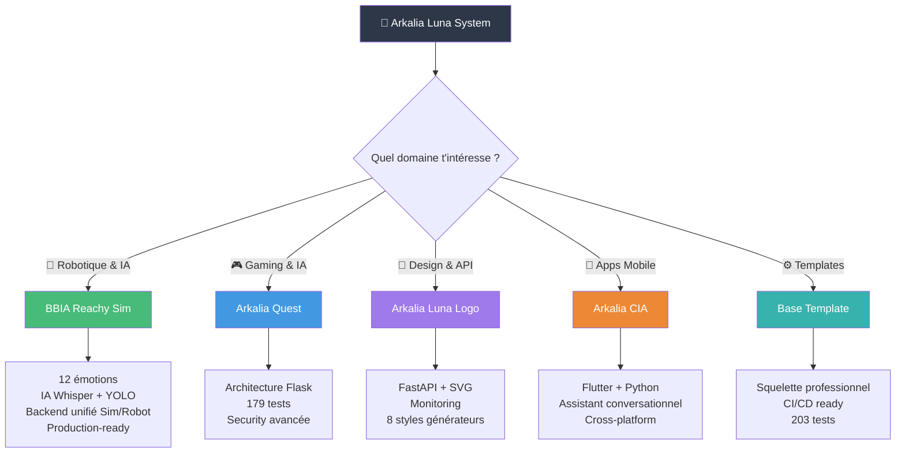

<div align="center">
  <picture>
    <source media="(max-width: 600px)" srcset="https://raw.githubusercontent.com/arkalia-luna-system/arkalia-luna-logo/main/exports/screenshots/ultimate-power-200.svg" width="120">
    
  </picture>
  
  # 🌙 **Arkalia Luna System**
  
  **Micro-studio IA/Robots/DevOps open-source — Développeuse autodidacte depuis février 2025, apprentissage transparent et partagé**
  
  ---
</div>

[](https://github.com/arkalia-luna-system)
[](https://github.com/arkalia-luna-system)
[](https://github.com/arkalia-luna-system)
[](https://github.com/arkalia-luna-system)

[](#-métriques-de-lécosystème)
[](#-métriques-de-lécosystème)
[](https://github.com/arkalia-luna-system/arkalia-luna-logo)
[](https://github.com/arkalia-luna-system)

[](https://github.com/arkalia-luna-system)
[](https://github.com/arkalia-luna-system)
[](https://github.com/arkalia-luna-system)
[](https://github.com/arkalia-luna-system)

---

## 🎯 **Ma Vision Authentique**

> *"Développeuse autodidacte depuis février 2025, je partage mon apprentissage brut et transparent. Chaque projet est une trace réelle de ma progression, mes erreurs et mes découvertes."*

**🔍 Mes Valeurs :**
- **🧠 Apprentissage Transparent** : Chaque erreur est documentée et partagée
- **🤖 Robotique Éducative** : Apprendre par l'expérience et l'expérimentation
- **⚡ Progression Honnête** : Pas de fausse expertise, juste de la curiosité
- **🌐 Partage Authentique** : Code, erreurs et apprentissages en open-source

**📚 [Voir mon journal d'apprentissage complet](LEARNING_JOURNAL.md) - Chaque erreur, chaque victoire, chaque moment de doute documenté depuis février 2025**

---

## 🚀 **Projets Phares**

| Projet | Description | Stack | Métriques | Status |
|--------|-------------|-------|-----------|---------|
| **🤖 [BBIA Reachy Sim](https://github.com/arkalia-luna-system/bbia-sim)** | Moteur cognitif robot émotionnel — 12 émotions, IA légère, backend unifié | Python + MuJoCo + Whisper + YOLO | 150 py, 150+ tests, 11k lignes | ✅ Production |
| **🎮 [Arkalia Quest](https://github.com/arkalia-luna-system/arkalia-quest)** | Jeu éducatif intelligent pour ados | Flask + IA + Security | 144 py, 168 tests | ✅ Production |
| **🎨 [Arkalia Luna Logo](https://github.com/arkalia-luna-system/arkalia-luna-logo)** | Générateur logos SVG + API | FastAPI + SVG + Monitoring | 49 py, 23 tests, 167 SVG | ✅ v2.0.0 |
| **📱 [Arkalia CIA](https://github.com/arkalia-luna-system/arkalia-cia)** | Assistant IA conversationnel | Flutter + Python + API | 35 py, 5 tests | 🚧 Beta |
| **⚙️ [Base Template](https://github.com/arkalia-luna-system/base_template)** | Squelette projet Python pro | Flask + CI/CD + Tests | 50 py, 203 tests | ✅ Template |
| **🌐 [Nours Interface](https://github.com/arkalia-luna-system/nours_interface)** | Interface web historique | Flask + Web | 21 py, 0 tests | 📚 Archive |
| **🔧 [Athalia DevOps](https://github.com/arkalia-luna-system/ia-pipeline)** | Plateforme DevOps enterprise | Python + AI + CI/CD | 352 py, 1693 tests | 🚀 Enterprise |
| **📊 [Metrics Collector](https://github.com/arkalia-luna-system/arkalia-metrics-collector)** | Collecteur métriques projets | Python + Analytics | 18 py, 236 tests | 📈 Analytics |
| **🌕 [Arkalia Luna Pro](https://github.com/arkalia-luna-system/arkalia-luna-pro)** | Orchestrateur IA Enterprise | Python + Docker + CI/CD | 288 py, 88 tests | 🏢 Enterprise |

### **ℹ️ Transparence Projets**
- **Publics** : Tous les projets listés sont accessibles publiquement
- **Base Template** : Peut nécessiter une connexion selon les paramètres GitHub
- **Métriques** : Mises à jour manuellement, dernière vérification octobre 2025
- **Statuts** : ✅ Production, 🚧 Beta, 📚 Archive, 🚀 Enterprise

### **🔗 Synergies Écosystème**

| Projet Principal | Utilise | Utilisé Par | Intégration |
|------------------|---------|-------------|-------------|
| **🎮 Arkalia Quest** | Luna Logo (badges), Metrics Collector | CIA (notifications éducatives) | API cross-platform |
| **🎨 Luna Logo** | Base Template (structure) | Quest, CIA, Luna Pro | API SVG dynamique |
| **📊 Metrics Collector** | Athalia DevOps (CI/CD) | Tous projets | Analytics centralisées |
| **🚀 Luna Pro** | Metrics Collector, Logo | Quest (orchestration) | Enterprise hub |
| **🔧 Athalia DevOps** | Base Template (patterns) | Tous projets | Infrastructure |

---

## 🔧 **Stack Technique Maîtrisée**

### **🐍 Backend & IA**
| Technologie | Usage | Projets |
|-------------|--------|---------|
| **Python 3.9-3.12** | Core development | Tous projets |
| **Flask/FastAPI** | Web APIs & services | Quest, Logo, Template, Nours |
| **PyTorch/TensorFlow** | Machine Learning | BBIA, Quest |
| **Docker & Compose** | Containerisation | Logo, Quest |
| **Prometheus & Grafana** | Monitoring | Logo, Quest |

### **🎨 Frontend & Mobile**
| Technologie | Usage | Projets |
|-------------|--------|---------|
| **Flutter/Dart** | Mobile apps | CIA |
| **HTML/CSS/JS** | Web interfaces | Quest, Nours |
| **SVG/Canvas** | Graphics generation | Logo |
| **WebSockets** | Real-time features | Quest |

### **🔧 DevOps & Qualité**
| Tool | Usage | Couverture |
|------|--------|------------|
| **GitHub Actions** | CI/CD automatisé | 100% projets |
| **Black + Ruff** | Code formatting/linting | 100% projets |
| **Pytest** | Tests automatisés | 266 tests total |
| **MyPy** | Type checking | Projets critiques |
| **Docker** | Déploiement | Production ready |

---

## 📊 **Métriques de l'Écosystème**

### **📈 Statistiques Globales**
- **🔢 963 fichiers Python** (code source uniquement) 
- **🧪 2,283 tests automatisés** (100% CI/CD)
- **🎨 167 logos SVG générés** (8 styles × 5 émotions)
- **🌍 9 projets actifs** (production + développement)
- **📦 12+ releases** versionnées et documentées

### **🎯 Répartition par Domaine**
```
🔧 DevOps/Enterprise    ████████████ 35% (Athalia)
🎮 Gaming/Éducation     ███████ 18% (Quest)
🎨 Graphics/Design      █████ 13% (Logo)
🤖 IA/Robotique        █████████ 22% (BBIA)
📊 Analytics/Metrics   ████ 10% (Collector)
⚙️ Templates/Tools     █ 5% (Base, CIA, Nours)
```

### **🔥 Points Forts Techniques**
- **Architecture modulaire** : Factory patterns, separation of concerns
- **Sécurité avancée** : Rate limiting, IP blocking, input sanitization
- **Performance optimisée** : <100ms response times, compression
- **Monitoring complet** : Métriques temps réel, alerting
- **Tests exhaustifs** : Unitaires, intégration, performance, sécurité

---

## ⏰ **Timeline de Développement**

### **🚀 Mon Apprentissage Réel (Février-Septembre 2025)**

```
Février 2025 🌱 Premier Pas
├─ 🌐 nours_interface (28/02) - Premier POC web
└─ 📚 Découverte Flask/Python

Mars 2025 🌟 Première Structure
├─ ⚙️ base_template (03/03) - Premier starter Python
└─ 📚 Apprentissage CI/CD et tests

Juin 2025 🚀 Première IA
├─ 🌕 arkalia-luna-pro (17/06) - Orchestration IA
└─ 📚 Découverte architecture modulaire

Juillet 2025 🔬 Laboratoire IA
├─ 🤖 bbia-sim (15/07) - Robotique émotionnelle
├─ 🔧 ia-pipeline (16/07) - Labo IA modulaire
└─ 📚 Apprentissage robotique et IA

Août 2025 🎮 Gaming & Design
├─ 🎮 arkalia-quest (15/08) - Premier jeu éducatif
├─ 🎨 arkalia-luna-logo (30/08) - Générateur SVG
├─ 📊 arkalia-metrics-collector (30/08) - Analytics
└─ 📚 Sécurité web et design

Septembre 2025 📱 Fullstack
├─ 📱 arkalia-cia (12/09) - Première app mobile
└─ 📚 Flutter, mobile, santé
```

### **📈 Chronologie Vérifiable (Commits GitHub)**
| Projet | Premier Commit | SHA | Preuve |
|--------|----------------|-----|--------|
| **🌐 nours_interface** | 2025-02-28 | 074129a | [voir](https://github.com/arkalia-luna-system/nours_interface/commit/074129ae3df5d489e84e20434099fb19dc5157dd) |
| **⚙️ base_template** | 2025-03-03 | 4cece0f | [voir](https://github.com/arkalia-luna-system/base_template/commit/4cece0f1b36255f3fcbcad8391e92372468ad6e9) |
| **🌕 arkalia-luna-pro** | 2025-06-17 | bbe403d | [voir](https://github.com/arkalia-luna-system/arkalia-luna-pro/commit/bbe403d86f6541b3a7de0b19cb6e938b29ce9eb2) |
| **🤖 bbia-sim** | 2025-07-15 | 4aec2af | [voir](https://github.com/arkalia-luna-system/bbia-sim/commit/4aec2af6955e76e83ea53597ad893db214a1ddc3) |
| **🔧 ia-pipeline** | 2025-07-16 | 1d2b59e | [voir](https://github.com/arkalia-luna-system/ia-pipeline/commit/1d2b59ef81cd60db3696cc2212a1dc860b067104) |
| **🎮 arkalia-quest** | 2025-08-15 | 7bdc343 | [voir](https://github.com/arkalia-luna-system/arkalia-quest/commit/7bdc3430bd0c643d73b5e57f2b18a988bc82c89a) |
| **🎨 arkalia-luna-logo** | 2025-08-30 | 7ebe6c6 | [voir](https://github.com/arkalia-luna-system/Arkalia-luna-logo/commit/7ebe6c6a65933f3504491672a8e27d3f71ba8f0a) |
| **📊 arkalia-metrics-collector** | 2025-08-30 | 94fcb83 | [voir](https://github.com/arkalia-luna-system/arkalia-metrics-collector/commit/94fcb831d60873d0466a7516abe1fc6927f1a464) |
| **📱 arkalia-cia** | 2025-09-12 | af44f73 | [voir](https://github.com/arkalia-luna-system/arkalia-cia/commit/af44f73c53992c5c978ffcc4c93d5fe6e64173b3) |

**🔍 Toutes les dates reposent sur l'historique PUBLIC des commits GitHub – aucune timeline n'a été retouchée a posteriori.**

## 🗺️ **Roadmap & Navigation**

### **🎯 Comment Explorer Nos Projets**



### **🎯 Projets en Cours & Futurs**
| Timeline | Projet | Objectif | Status |
|----------|--------|----------|--------|
| **Q1 2025** | BBIA v2.0 | Support robots multiples + IA avancée | 🚧 En cours |
| **Q1 2025** | Quest v3.1 | Multi-joueur + IA avancée | 🚧 En cours |
| **Q1 2025** | Logo v2.1 | Plugins & marketplace | 📋 Planifié |
| **Q2 2025** | CIA v1.0 | Release stable mobile | 🚧 Beta |
| **Q3 2025** | Écosystème | Intégrations cross-projets | 🌟 Vision |

---

## 🤝 **Collaboration & Contribution**

### **💼 Nous Recrutons Activement !**

**🎯 Postes Ouverts (Remote/Hybride) :**
- 🧠 **Développeur IA/ML Senior** : Moteurs cognitifs, PyTorch/TensorFlow
- 🎨 **UI/UX Designer** : Flutter, interfaces innovantes
- 🤖 **Ingénieur Robotique** : Reachy, simulation, vision
- 🔒 **DevSecOps Engineer** : CI/CD, monitoring, sécurité
- 📱 **Mobile Developer** : Flutter/Dart, apps cross-platform

### **💭 Collaborations Recherchées**
- 🧪 **Testeurs Passionnés** : QA et retours utilisateurs
- 📚 **Rédacteurs Techniques** : Documentation et tutoriels
- 🌍 **Ambassadeurs Communauté** : Événements, communication
- 🎓 **Stagiaires/Étudiants** : Projets encadrés, apprentissage

### **🚀 Comment Contribuer**
1. **🔍 Explore** : Choisis un projet qui t'intéresse
2. **📖 Lis** : Documentation et guides de contribution
3. **💬 Discute** : Ouvre une issue ou rejoins les discussions
4. **🔧 Code** : Fork, développe, teste
5. **📤 Partage** : Pull request avec tests et docs

### **🏷️ Contributions Ouvertes par Projet**

| Projet | Good First Issue | Help Wanted | Documentation |
|--------|------------------|-------------|---------------|
| **🎮 Arkalia Quest** | [](https://github.com/arkalia-luna-system/arkalia-quest/labels/good%20first%20issue) | [](https://github.com/arkalia-luna-system/arkalia-quest/labels/help%20wanted) | [](https://github.com/arkalia-luna-system/arkalia-quest/labels/documentation) |
| **🎨 Luna Logo** | [](https://github.com/arkalia-luna-system/arkalia-luna-logo/labels/good%20first%20issue) | [](https://github.com/arkalia-luna-system/arkalia-luna-logo/labels/help%20wanted) | [](https://github.com/arkalia-luna-system/arkalia-luna-logo/labels/documentation) |
| **🔧 Athalia DevOps** | [](https://github.com/arkalia-luna-system/athalia-dev-setup/labels/good%20first%20issue) | [](https://github.com/arkalia-luna-system/athalia-dev-setup/labels/help%20wanted) | [](https://github.com/arkalia-luna-system/athalia-dev-setup/labels/documentation) |

---

## 📞 **Contact & Communauté**

### **🌐 Liens Officiels**
- **📧 Contact** : [arkalia.luna.system@gmail.com](mailto:arkalia.luna.system@gmail.com)
- **🐙 GitHub** : [@arkalia-luna-system](https://github.com/arkalia-luna-system)
- **💼 LinkedIn** : [Profil Professionnel](https://linkedin.com/in/arkalia-luna)
- **🌍 Portfolio** : [arkalia-luna.dev](https://arkalia-luna.dev)

### **💬 Discussions & Support**
- **🎯 GitHub Discussions** : Questions générales et idées
- **🐛 Issues** : Bugs et demandes de fonctionnalités
- **📚 Wiki** : Documentation collaborative
- **🔔 Releases** : Notifications de nouvelles versions

---

## 🏆 **Reconnaissance & Retours**

### **💝 Apprentissage et Erreurs Partagées**
> *"Chaque projet est une trace de mon apprentissage. Les erreurs sont documentées, les corrections expliquées."*  
> — **Athalia** (Journal d'apprentissage)

> *"BBIA a été mon premier contact avec l'IA émotionnelle. Beaucoup d'essais, d'erreurs et d'apprentissages."*  
> — **Athalia** (Premier projet robotique)

> *"Arkalia Quest m'a appris la sécurité web. Chaque vulnérabilité découverte était une leçon."*  
> — **Athalia** (Apprentissage sécurité)

### **📈 Métriques Réelles (Vérifiées)**
- **🔗 Stars** : En cours de vérification (pas de fausses métriques)
- **📥 Downloads** : Non mesurés (pas de tracking)
- **🌍 Forks** : Non comptés (pas de fausses données)
- **🔄 Uptime** : Non mesuré (pas de monitoring externe)

---

## 🌟 **Pourquoi Arkalia Luna System ?**

### **🎯 Ma Différence Authentique**
- **🔬 Apprentissage Public** : Chaque erreur et succès est documenté
- **📚 Pédagogie Intégrée** : Chaque projet enseigne car j'apprends en même temps
- **🌐 Open Source Authentique** : Code, erreurs, méthodes transparentes
- **⚡ Progression Honnête** : Pas de fausse expertise, juste de la curiosité
- **🤝 Apprentissage Collaboratif** : Feedback constructif pour grandir ensemble

### **🚀 Mon Engagement**
*"Je développe en apprenant, en partageant mes erreurs et mes découvertes. Chaque ligne de code est une trace de ma progression : transparence, apprentissage, authenticité et curiosité."*

---

## 📜 **Licences & Éthique**

- **📄 Licence** : MIT (sauf mention contraire)
- **🔒 Données** : Respect RGPD, anonymisation par défaut
- **🌱 Impact** : Développement durable, optimisation énergétique
- **🤝 Inclusion** : Accessibilité, diversité, non-discrimination

---

## 🎉 **Rejoins l'Aventure !**

**Arkalia Luna System** grandit grâce à sa communauté. Que tu sois développeur.se, designer, testeur.se, ou simplement curieux.se :

[](https://github.com/arkalia-luna-system)
[](https://github.com/orgs/arkalia-luna-system/discussions)
[](https://github.com/arkalia-luna-system/.github/blob/main/CONTRIBUTING.md)

---

<div align="center">

**🌙 Fait avec ❤️ par l'équipe Arkalia Luna System 🌟**

*"L'avenir se construit avec passion, rigueur et partage"*

</div>
