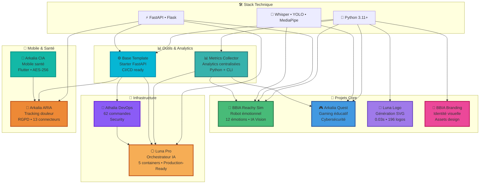

# 🌙 Arkalia Luna System

**Architecture de systèmes IA & robotique • 12 projets en production • Observabilité • DevOps**

<code style="background: rgba(15, 23, 42, 0.9); color: #e5e7eb; padding: 6px 14px; border-radius: 8px; font-size: 0.95em; border: 1px solid rgba(148, 163, 184, 0.5);">"Concevoir des systèmes robustes, lisibles et utiles."</code>

 

## 🖤 Systèmes en Production

- **Arkalia Luna Pro** — Orchestrateur IA d’entreprise (5 containers, monitoring complet, CI/CD).
- **Arkalia CIA & ARIA** — Santé numérique : mobile seniors offline, laboratoire IA personnel, données chiffrées.
- **BBIA Reachy Sim** — Moteur cognitif robotique (12 émotions, vision, IA temps réel).
- **Arkalia Luna Logo & Branding** — Génération de logos SVG émotionnels pour tout l’écosystème.
- **Arkalia Metrics Collector & Base Template** — Collecte de métriques multi‑repos et squelette FastAPI de production.

## 🎯 Positionnement

- **Approche** — Construire des produits concrets, maintenables et documentés.
- **Standard** — Tests automatisés, CI/CD, observabilité et amélioration continue.
- **Focus** — IA appliquée, robotique, santé numérique et outillage plateforme.

---

### ⚡ Métriques Clés

|  |  |  |  |
|:---:|:---:|:---:|:---:|
| **550+ modules** | **~64% coverage** | **12 projets** | **196 SVG** |

 

**Stack Technique**

---

## 📊 En Chiffres

**Vue d'ensemble de l'écosystème en quelques chiffres clés**

| Métrique | Valeur | Détails |
|:--------:|:------:|:-------|
| **📦 Projets** | **12** | Projets en production active |
| **🧪 Tests** | **550+** | Tests automatisés |
| **📈 Couverture** | **~64%** | Couverture moyenne |
| **🔧 Modules** | **550+** | Modules Python |
| **🎨 Logos SVG** | **196** | Logos générés |
| **🐳 Containers** | **5** | Containers Docker (Luna Pro) |
| **⚙️ Workflows CI** | **12+** | Workflows GitHub Actions |
| **🔌 Connecteurs** | **13** | Connecteurs santé (ARIA) |

*Métriques mises à jour automatiquement via `arkalia-metrics-collector`*

---

## 🧬 Tableau de Bord Système

<!-- AUTO-UPDATE:status -->
### 🔮 Tableau de Bord Système

_Vue temps réel des modules principaux de l'écosystème Arkalia Luna System._

| Module | Rôle | Statut | Dernier commit | Branche par défaut |
|:------:|:----:|:------:|:--------------:|:-------------------:|
| **[arkalia-luna-pro](https://github.com/arkalia-luna-system/arkalia-luna-pro)** | Core | `🟢 ONLINE` | il y a 48 j | `develop` |
| **[arkalia-cia](https://github.com/arkalia-luna-system/arkalia-cia)** | Santé / Mobile | `🟡 BETA` | il y a 6 j | `develop` |
| **[Arkalia-aria](https://github.com/arkalia-luna-system/Arkalia-aria)** | Santé / Mobile | `🟢 ONLINE` | il y a 47 j | `develop` |
| **[Arkalia-luna-logo](https://github.com/arkalia-luna-system/Arkalia-luna-logo)** | Design | `🟢 ONLINE` | il y a 55 j | `develop` |
| **[bbia-sim](https://github.com/arkalia-luna-system/bbia-sim)** | Robotique | `🟢 ONLINE` | il y a 6 j | `develop` |
| **[arkalia-quest](https://github.com/arkalia-luna-system/arkalia-quest)** | Gaming | `🟢 ONLINE` | il y a 3 min | `develop` |
| **[arkalia-metrics-collector](https://github.com/arkalia-luna-system/arkalia-metrics-collector)** | Metrics | `🟢 ONLINE` | il y a 14 h | `develop` |
| **[arkalia-luna-system](https://github.com/arkalia-luna-system/arkalia-luna-system)** | Profil | `🟢 ONLINE` | il y a 2 min | `develop` |
---

## 📑 Table des Matières

- [Systèmes en Production](#-systèmes-en-production)
- [Positionnement](#-positionnement)
- [Métriques Clés](#-métriques-clés)
- [En Chiffres](#-en-chiffres)
- [Tableau de Bord Système](#-tableau-de-bord-système)
- [Vision Système](#-vision-système)
- [Projets Featured](#-projets-featured)
- [Projet Principal : BBIA Reachy Sim](#-projet-principal--bbia-reachy-sim)
- [Projets Principaux](#-projets-principaux)
- [Tous les Projets](#-tous-les-projets)
- [Stack Technique](#️-stack-technique)
- [Architecture Écosystème](#️-architecture-écosystème)
- [Métriques de l'Écosystème](#-métriques-de-lécosystème)
- [Contribuer](#-contribuer)
- [Automatisation](#-automatisation)
- [Contact](#-contact)
- [Impact & Performance](#-impact--performance)
- [FAQ](#-faq)

---

## 🎯 Vision Système

Ce repository orchestre et centralise l'écosystème **Arkalia Luna System** : une suite complète de projets open-source couvrant la robotique, l'IA, le design, le mobile et l'infrastructure.

<!-- AUTO-UPDATE:vision -->
### 🏗️ Architecture de l'Écosystème

L'écosystème est organisé en **4 catégories principales** :

#### 🏢 **Projets Production**
Projets en production active, utilisés et maintenus :
- **arkalia-quest** : Jeu éducatif intelligent pour adolescents — IA LUNA, sécurit...
- **bbia-sim** : Cognitive robot engine for Reachy Mini | AI emotions, vision...
- **arkalia-cia** : Assistant santé mobile pour seniors — Flutter + Python, docu...
- **Arkalia-aria** : Laboratoire personnel santé/IA : suivi douleur, patterns psy...
- **arkalia-luna-pro** : Orchestrateur IA modulaire pour l'entreprise — Python/Docker...

#### 🎨 **Design & Branding**
Outils de génération et identité visuelle :
- **Arkalia-luna-logo** : Générateur de logos SVG techno-mystiques — 8 styles, 5 varia...
- **bbia_branding** : Assets Premium pour l'identité visuelle BBIA

#### 🔧 **Outils & Infrastructure**
Infrastructure et outils de développement :
- **arkalia-luna-system** : Mon profil GitHub personnalisé
- **arkalia-metrics-collector** : Collecteur de métriques universel et professionnel pour proj...
- **ia-pipeline** : Générateur IA souverain, modulaire, testé, automatisé, docum...
- **base_template** : Squelette projet Python/FastAPI pro — 58 scripts, tests comp...

#### 📦 **Archives**
Projets historiques conservés pour leur valeur pédagogique :
- **nours_interface** : Interface web historique Flask + CSS/JS — POC archivé 2025,...

---

## 🔥 Projets Featured

<!-- AUTO-UPDATE:featured -->
**Trois systèmes qui illustrent le niveau de production (architecture, tests, observabilité) de l’écosystème Arkalia Luna System.**

<table>
<tr>
<td align="center" width="33%">
<a href="https://github.com/arkalia-luna-system/arkalia-luna-pro">

  
<strong>arkalia-luna-pro</strong>
 
Orchestrateur IA modulaire pour l'entreprise — Pyt...
</a>
</td>
<td align="center" width="33%">
<a href="https://github.com/arkalia-luna-system/Arkalia-luna-logo">

  
<strong>Arkalia-luna-logo</strong>
 
Générateur de logos SVG techno-mystiques — 8 style...
</a>
</td>
<td align="center" width="33%">
<a href="https://github.com/arkalia-luna-system/arkalia-cia">

  
<strong>arkalia-cia</strong>
 
Assistant santé mobile pour seniors — Flutter + Py...
</a>
</td>
</tr>
</table>

---

## 🤖 Projet Principal : BBIA Reachy Sim

**Cognitive Engine • 12 émotions • IA temps réel**

*Robot émotionnel open-source avec moteur cognitif et expression d'émotions*

 

**Points Clés**

| **Fonctionnalité** | **Technologie** |
|:------------------:|:---------------:|
| 🤖 **12 émotions robotiques** | Transitions fluides |
| 👁️ **IA Vision** | YOLO + MediaPipe + DeepFace |
| 🗣️ **IA Vocale** | Whisper STT/TTS |
| 🎯 **Pose Detection** | MediaPipe 33 points |
| 🚀 **Backend unifié** | Sim/Robot |
| ✅ **Production-ready** | 68 fichiers Python, 1362 tests, 68.86% coverage |

**[Découvrir BBIA](https://github.com/arkalia-luna-system/bbia-sim)** • [Documentation](https://github.com/arkalia-luna-system/bbia-sim/blob/main/docs/GUIDE_DEBUTANT.md) • [Architecture](https://github.com/arkalia-luna-system/bbia-sim#-architecture-bbia-sim)

---

## 🚀 Projets Principaux

**Les 4 piliers opérationnels de l'écosystème** — en production, maintenus et documentés.

**Piliers** :
- **Luna Pro** : Orchestrateur IA modulaire pour l'entreprise
- **CIA** : Assistant IA conversationnel santé mobile
- **Quest** : Plateforme de jeu éducatif sécurisé
- **Luna Logo** : Générateur de logos SVG techno-mystiques

**🤖 BBIA Reachy Sim** : Projet principal robotique et R&D (voir section dédiée ci-dessus)

 

### 🌟 Autres Projets Principaux

<table>
<tr>
<td align="center" width="25%">
<a href="https://github.com/arkalia-luna-system/arkalia-luna-logo">

  
<strong>Luna Logo</strong>
 
Générateur SVG
</a>
</td>
<td align="center" width="25%">
<a href="https://github.com/arkalia-luna-system/arkalia-quest">

  
<strong>Arkalia Quest</strong>
 
Gaming éducatif
</a>
</td>
<td align="center" width="25%">
<a href="https://github.com/arkalia-luna-system/arkalia-aria">

  
<strong>Arkalia ARIA</strong>
 
Santé IA • RGPD
</a>
</td>
<td align="center" width="25%">
<a href="https://github.com/arkalia-luna-system/ia-pipeline">

  
<strong>IA Pipeline</strong>
 
DevOps • 62 cmd
</a>
</td>
</tr>
</table>

 

### 📋 Tous les Projets

<!-- AUTO-UPDATE:projects -->
| Projet | Description | Stack | Rôle | Status |
|:------:|:-----------:|:-----:|:----:|:-----:|
| **[arkalia-luna-system](https://github.com/arkalia-luna-system/arkalia-luna-system)** | Mon profil GitHub personnalisé | Python | 🌙 Profil | ✅ Production |
| **[arkalia-quest](https://github.com/arkalia-luna-system/arkalia-quest)** | Jeu éducatif intelligent pour adolescents — IA LUNA, sécurité avancée, gamification 🏆 Architectur... | IA | 🏢 Prod | ✅ Production |
| **[arkalia-metrics-collector](https://github.com/arkalia-luna-system/arkalia-metrics-collector)** | Collecteur de métriques universel et professionnel pour projets Python | Python + CLI | 🔧 Tooling | ✅ Production |
| **[ia-pipeline](https://github.com/arkalia-luna-system/ia-pipeline)** | Générateur IA souverain, modulaire, testé, automatisé, documenté | IA | 🔧 Tooling | ✅ Production |
| **[bbia-sim](https://github.com/arkalia-luna-system/bbia-sim)** | Cognitive robot engine for Reachy Mini \| AI emotions, vision \| Python, MuJoCo | MuJoCo + IA | 🏢 Prod | ✅ Production |
| **[arkalia-cia](https://github.com/arkalia-luna-system/arkalia-cia)** | Assistant santé mobile pour seniors — Flutter + Python, documents médicaux chiffrés AES-256, 100%... | Flutter | 🚧 Beta | 🚧 Beta |
| **[Arkalia-aria](https://github.com/arkalia-luna-system/Arkalia-aria)** | Laboratoire personnel santé/IA : suivi douleur, patterns psy, synchronisation CIA, export pro | IA | 🏢 Prod | ✅ Production |
| **[Arkalia-luna-logo](https://github.com/arkalia-luna-system/Arkalia-luna-logo)** | Générateur de logos SVG techno-mystiques — 8 styles, 5 variantes émotionnelles 🌙 FastAPI + Docker... | Design | 🏢 Prod | ✅ Production |
| **[base_template](https://github.com/arkalia-luna-system/base_template)** | Squelette projet Python/FastAPI pro — 58 scripts, tests complets, CI/CD 🚀 Starter kit prêt à l'em... | FastAPI | 🔧 Tooling | ✅ Template |
| **[arkalia-luna-pro](https://github.com/arkalia-luna-system/arkalia-luna-pro)** | Orchestrateur IA modulaire pour l'entreprise — Python/Docker \| 7 modules IA avancés : ZeroIA, Cog... | Docker + IA | 🏢 Prod | 🚀 Enterprise |
| **[bbia_branding](https://github.com/arkalia-luna-system/bbia_branding)** | Assets Premium pour l'identité visuelle BBIA | Design | 🏢 Prod | ✅ Production |
| **[nours_interface](https://github.com/arkalia-luna-system/nours_interface)** | Interface web historique Flask + CSS/JS — POC archivé 2025, valeur pédagogique 🎓 Example d'archit... | Flask | 📦 Archive | 📦 Archivé |
---

## 🛠️ Stack Technique

| Type | Technologies | Usage |
|:----:|:------------:|:-----:|
| **Core** | Python 3.11-3.12 | 100% projets backend |
| **APIs** | FastAPI, Flask | 8 projets |
| **IA** | PyTorch, Whisper, YOLO, HuggingFace, MediaPipe, DeepFace | BBIA, Quest |
| **Graphics & Design** | SVG, Canvas, PIL, Branding Assets | Luna Logo, BBIA Branding |
| **Mobile** | Flutter, Dart | CIA, ARIA |
| **DevOps** | Docker, Prometheus, Grafana | Luna Pro, Logo |
| **QA** | Pytest, Black, Ruff | Tests automatisés, 100% CI/CD |

---

## 🗺️ Architecture Écosystème

```mermaid
flowchart TB
 subgraph stack["🛠️ Stack Technique"]
 PYTHON["🐍 Python 3.11+"]
 APIS["⚡ FastAPI • Flask"]
 AI["🤖 Whisper • YOLO • MediaPipe"]
 end

 subgraph core["🎯 Projets Core"]
 BBIA["🤖 BBIA Reachy Sim<br/>Robot émotionnel<br/>12 émotions • IA Vision"]
 QUEST["🎮 Arkalia Quest<br/>Gaming éducatif<br/>Cybersécurité"]
 LOGO["🎨 Luna Logo<br/>Génération SVG<br/>0.03s • 196 logos"]
 BRANDING["🎨 BBIA Branding<br/>Identité visuelle<br/>Assets design"]
 end

 subgraph infra["🔧 Infrastructure"]
 ATHALIA["🔧 Athalia DevOps<br/>62 commandes<br/>Security"]
 LUNA["🌕 Luna Pro<br/>Orchestrateur IA<br/>5 containers • Production-Ready"]
 end

 subgraph mobile["📱 Mobile & Santé"]
 CIA["📱 Arkalia CIA<br/>Mobile santé<br/>Flutter • AES-256"]
 ARIA["🧠 Arkalia ARIA<br/>Tracking douleur<br/>RGPD • 13 connecteurs"]
 end

 subgraph utils["📊 Outils & Analytics"]
 METRICS["📊 Metrics Collector<br/>Analytics centralisées<br/>Python + CLI"]
 TEMPLATE["⚙️ Base Template<br/>Starter FastAPI<br/>CI/CD ready"]
 end

 PYTHON --> BBIA
 PYTHON --> QUEST
 PYTHON --> LOGO
 PYTHON --> BRANDING
 PYTHON --> METRICS
 PYTHON --> TEMPLATE

 APIS --> BBIA
 APIS --> LUNA
 APIS --> ARIA
 APIS --> TEMPLATE

 AI --> BBIA
 AI --> QUEST

 METRICS --> BBIA
 METRICS --> QUEST
 METRICS --> LUNA

 TEMPLATE --> ATHALIA
 TEMPLATE --> LUNA
 TEMPLATE --> ARIA

 ATHALIA --> LUNA
 CIA --> ARIA

 style BBIA fill:#48bb78,stroke:#2d7a4d,stroke-width:3px
 style QUEST fill:#4299e1,stroke:#2c5aa0,stroke-width:3px
 style LOGO fill:#9f7aea,stroke:#6b46c1,stroke-width:3px
 style LUNA fill:#f6ad55,stroke:#c05621,stroke-width:3px
 style ARIA fill:#ed8936,stroke:#c05621,stroke-width:3px
 style METRICS fill:#38b2ac,stroke:#2c7a7b,stroke-width:3px
 style BRANDING fill:#ec4899,stroke:#be185d,stroke-width:3px
 style CIA fill:#14b8a6,stroke:#0d9488,stroke-width:3px
 style ATHALIA fill:#8b5cf6,stroke:#6d28d9,stroke-width:3px
 style TEMPLATE fill:#06b6d4,stroke:#0891b2,stroke-width:3px
```

---

## 📊 Métriques de l'Écosystème

<!-- AUTO-UPDATE:stats -->
### 📈 Statistiques

- **Projets** : 12 au total
- **Langages** : Python (12), Markdown (12), Shell (11), JSON (10), YAML (8), Makefile (7), HTML (6), Dockerfile (5), JavaScript (2), CSS (1), Dart (1)

*Dernière mise à jour : 26 avril 2026*
<!-- AUTO-UPDATE:languages -->

### 🎯 Roadmap

| Timeline | Projet | Objectif | Status |
|:--------:|:------:|:--------:|:------:|
| **Q1 2026** | BBIA v2.0 | Robots multiples + IA avancée | 📋 Planifié |
| **Q1 2026** | Luna Logo v3.0 | Plugins & marketplace | 📋 Planifié |
| **Q1 2026** | Arkalia CIA v1.0 | Release stable mobile | 🚧 En cours |
| **Q2 2026** | Quest v4.0 | Multi-joueur + IA avancée | 📋 Planifié |
| **Q2 2026** | Arkalia ARIA v2.0 | IA avancée + connecteurs | 📋 Planifié |
| **Q3 2026** | Luna Pro v4.0 | Scaling enterprise | 📋 Planifié |
| **Q4 2026** | Écosystème unifié | Intégrations cross-projets | 🌟 Vision |

---

## 🤝 Contribuer

**[Créer une issue](https://github.com/arkalia-luna-system/arkalia-luna-system/issues/new)** • **[Discussions](https://github.com/orgs/arkalia-luna-system/discussions)** • **[Wiki](https://github.com/arkalia-luna-system/arkalia-luna-system/wiki)**

**Comment contribuer :** Corriger une typo • Reporter un bug • Proposer une feature • Ajouter un test • Améliorer la doc

**Ressources :** [Wiki](https://github.com/arkalia-luna-system/arkalia-luna-system/wiki) • [Discussions](https://github.com/orgs/arkalia-luna-system/discussions) • [@arkalia-luna-system](https://github.com/arkalia-luna-system)

*Réponse rapide pour les questions techniques et contributions. Tous les projets sont ouverts aux contributions.*

---

## 🔧 Automatisation

Ce repository utilise un système d'automatisation complet pour maintenir le profil à jour :

- **📡 Découverte automatique** : `update-profile.py` découvre tous les projets GitHub
- **📝 Mise à jour automatique** : `auto-update-readme.py` met à jour le README
- **🔍 Audit automatique** : `scripts/audit-projects.py` audite la qualité des projets
- **📊 Métriques automatiques** : Intégration avec `arkalia-metrics-collector`
- **🔄 CI/CD** : Workflows GitHub Actions pour tout automatiser

**Documentation complète :** [docs/AUTOMATISATION-COMPLETE.md](docs/AUTOMATISATION-COMPLETE.md)

**Script tout-en-un :** `./scripts/update-all.sh` (découvre, met à jour, audite)

---

## 📞 Contact

**Email** : [arkalia.luna.system@gmail.com](mailto:arkalia.luna.system@gmail.com)  
**GitHub** : [@arkalia-luna-system](https://github.com/arkalia-luna-system)

---

## 📊 Impact & Performance

| Métrique | Valeur | Détails |
|:--------:|:------:|:-------|
| **Couverture Tests** | ~64% | BBIA : 1362 tests, 68 fichiers Python |
| **Temps Génération** | 0.03s | Luna Logo : génération SVG |
| **Containers** | 5 | Luna Pro : orchestration complète (5 actifs) |
| **Connecteurs** | 13 | ARIA : intégrations santé |
| **Commandes DevOps** | 62 | Athalia : pipeline sécurisé |
| **Releases** | 12+ | Versions stables déployées |

---

## 🎯 FAQ

<b>Q: Comment démarrer avec un projet ?</b>

A: *Consultez la section [Projets Phares](#-projets-phares) ci-dessus. Chaque projet a sa documentation complète dans son repository GitHub avec guides de démarrage rapide.*

<b>Q: Qui peut contribuer ?</b>

A: *Tous les contributeurs sont les bienvenus. Designer, développeur, maker... Chaque point de vue enrichit le projet.*

<b>Q: Que faire si je trouve un bug ?</b>

A: *Ouvrez une issue avec détails (screenshots si possible). Fix sous 48h si critique.*

<b>Q: Comment sont organisés les projets ?</b>

A: *L'écosystème est structuré en 4 catégories : Core (BBIA, Quest, Logo), Infrastructure (DevOps, Luna Pro), Mobile & Santé (CIA, ARIA), et Outils (Metrics, Template). Voir l'[Architecture Écosystème](#️-architecture-écosystème) pour plus de détails.*

<b>Q: Quelles technologies sont utilisées ?</b>

A: *Python 3.11+ pour le backend, FastAPI/Flask pour les APIs, PyTorch/Whisper/YOLO pour l'IA, Flutter pour le mobile, Docker pour l'orchestration. Voir la [Stack Technique](#️-stack-technique) complète.*

---

**[Explorer les Projets](https://github.com/arkalia-luna-system)** • **[Discussions](https://github.com/orgs/arkalia-luna-system/discussions)** • **[Contribuer](https://github.com/arkalia-luna-system/arkalia-luna-system/blob/main/docs/CONTRIBUTING.md)**

 

 

**🌙 Arkalia Luna System** — Open Source • 12 Projets • 550+ Modules • Design & Branding

<code style="background: rgba(15, 23, 42, 0.9); color: #e5e7eb; padding: 6px 14px; border-radius: 8px; font-size: 0.95em; border: 1px solid rgba(148, 163, 184, 0.5);">"Build. Ship. Observe. Iterate."</code>

 

