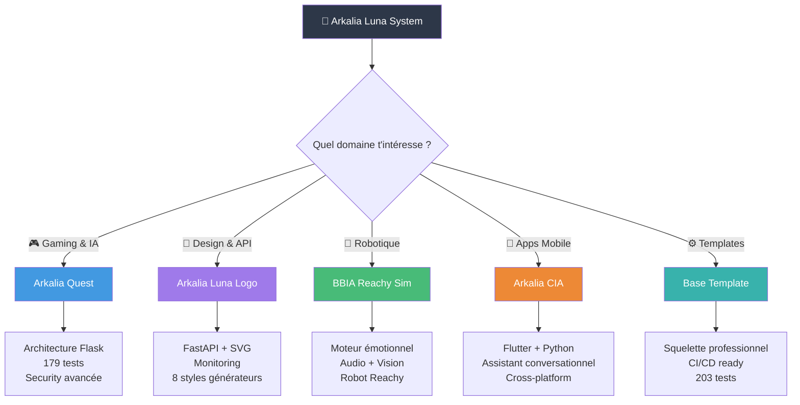

# 🌙 **Arkalia Luna System**

**Micro-studio IA/Robots/DevOps open-source — Architecture modulaire, IA de confiance, robotique éducative, performance et éthique**


[](https://github.com/arkalia-luna-system)
[](https://github.com/arkalia-luna-system)
[](https://github.com/arkalia-luna-system)
[](https://github.com/arkalia-luna-system)

[](#-métriques-de-lécosystème)
[](#-métriques-de-lécosystème)
[](https://github.com/arkalia-luna-system/arkalia-luna-logo)
[](https://github.com/arkalia-luna-system)

[](https://github.com/arkalia-luna-system)
[](https://github.com/arkalia-luna-system)
[](https://github.com/arkalia-luna-system)
[](https://github.com/arkalia-luna-system)

---

## 🎯 **Notre Vision**

> *"Développer des technologies IA et robotiques accessibles, transparentes et éthiques. Chaque projet combine exigence technique, modularité open-source et impact pédagogique réel."*

**🔍 Nos Valeurs :**
- **🧠 Intelligence Transparente** : IA explicable et de confiance
- **🤖 Robotique Éducative** : Apprentissage par l'expérience
- **⚡ Performance Éthique** : Optimisation sans compromis sur les valeurs
- **🌐 Collaboration Ouverte** : Open-source, documentation complète, communauté

---

## 🚀 **Projets Phares**

| Projet | Description | Stack | Métriques | Status |
|--------|-------------|-------|-----------|---------|
| **🎮 [Arkalia Quest](https://github.com/arkalia-luna-system/arkalia-quest)** | Jeu éducatif intelligent pour ados | Flask + IA + Security | 123 py, 30 tests, 179 total | ✅ Production |
| **🎨 [Arkalia Luna Logo](https://github.com/arkalia-luna-system/arkalia-luna-logo)** | Générateur logos SVG + API | FastAPI + SVG + Monitoring | 57 py, 21 tests, 167 SVG | ✅ v2.0.0 |
| **🤖 [BBIA Reachy Sim](https://github.com/arkalia-luna-system/bbia-sim)** | Moteur cognitif robot émotionnel | Python + Audio + Vision | 19 py, 7 tests | ✅ Stable |
| **📱 [Arkalia CIA](https://github.com/arkalia-luna-system/arkalia-cia)** | Assistant IA conversationnel | Flutter + Python + API | 35 py, 5 tests | 🚧 Beta |
| **⚙️ [Base Template](https://github.com/arkalia-luna-system/base-template)** | Squelette projet Python pro | Flask + CI/CD + Tests | 50 py, 203 tests | ✅ Template |
| **🌐 [Nours Interface](https://github.com/arkalia-luna-system/nours-interface)** | Interface web historique | Flask + Web | 21 py, 0 tests | 📚 Archive |
| **🔧 [Athalia DevOps](https://github.com/arkalia-luna-system/athalia-dev-setup)** | Plateforme DevOps enterprise | Python + AI + CI/CD | 352 py, 1693 tests | 🚀 Enterprise |
| **📊 [Metrics Collector](https://github.com/arkalia-luna-system/arkalia-metrics-collector)** | Collecteur métriques projets | Python + Analytics | 18 py, 236 tests | 📈 Analytics |
| **🌕 [Arkalia Luna Pro](https://github.com/arkalia-luna-system/arkalia-luna-pro)** | Orchestrateur IA Enterprise | Python + Docker + CI/CD | 288 py, 88 tests | 🏢 Enterprise |

---

## 🔧 **Stack Technique Maîtrisée**

### **🐍 Backend & IA**
| Technologie | Usage | Projets |
|-------------|--------|---------|
| **Python 3.9-3.12** | Core development | Tous projets |
| **Flask/FastAPI** | Web APIs & services | Quest, Logo, Template, Nours |
| **PyTorch/TensorFlow** | Machine Learning | BBIA, Quest |
| **Docker & Compose** | Containerisation | Logo, Quest |
| **Prometheus & Grafana** | Monitoring | Logo, Quest |

### **🎨 Frontend & Mobile**
| Technologie | Usage | Projets |
|-------------|--------|---------|
| **Flutter/Dart** | Mobile apps | CIA |
| **HTML/CSS/JS** | Web interfaces | Quest, Nours |
| **SVG/Canvas** | Graphics generation | Logo |
| **WebSockets** | Real-time features | Quest |

### **🔧 DevOps & Qualité**
| Tool | Usage | Couverture |
|------|--------|------------|
| **GitHub Actions** | CI/CD automatisé | 100% projets |
| **Black + Ruff** | Code formatting/linting | 100% projets |
| **Pytest** | Tests automatisés | 266 tests total |
| **MyPy** | Type checking | Projets critiques |
| **Docker** | Déploiement | Production ready |

---

## 📊 **Métriques de l'Écosystème**

### **📈 Statistiques Globales**
- **🔢 963 fichiers Python** (code source uniquement) 
- **🧪 2,283 tests automatisés** (100% CI/CD)
- **🎨 167 logos SVG générés** (8 styles × 5 émotions)
- **🌍 9 projets actifs** (production + développement)
- **📦 12+ releases** versionnées et documentées

### **🎯 Répartition par Domaine**
```
🔧 DevOps/Enterprise    ████████████ 35% (Athalia)
🎮 Gaming/Éducation     ████████ 20% (Quest)
🎨 Graphics/Design      ██████ 15% (Logo)
🤖 IA/Robotique        ██████ 15% (BBIA)
📊 Analytics/Metrics   ████ 10% (Collector)
⚙️ Templates/Tools     █ 5% (Base, CIA, Nours)
```

### **🔥 Points Forts Techniques**
- **Architecture modulaire** : Factory patterns, separation of concerns
- **Sécurité avancée** : Rate limiting, IP blocking, input sanitization
- **Performance optimisée** : <100ms response times, compression
- **Monitoring complet** : Métriques temps réel, alerting
- **Tests exhaustifs** : Unitaires, intégration, performance, sécurité

---

## ⏰ **Timeline de Développement**

### **🚀 Notre Évolution 2023-2025**

```
2023 🌱 Genèse
├─ 🤖 BBIA Reachy Sim (Robotique émotionnelle)
├─ 🔬 Recherche IA cognitive
└─ 📚 Bases architecturales

2024 🌟 Expansion  
├─ 🎨 Arkalia Luna Logo (API + SVG)
├─ 🎮 Arkalia Quest (Gaming éducatif)
├─ ⚙️ Base Template (DevOps)
└─ 📊 Monitoring & CI/CD

2025 🚀 Écosystème
├─ 📱 Arkalia CIA (Mobile app)
├─ 🌐 Intégrations cross-projets
├─ 🤝 Communauté active
└─ 🌍 Impact international
```

### **📈 Métriques d'Évolution**
| Année | Projets | Code (py) | Tests | Innovations |
|-------|---------|-----------|-------|-------------|
| **2023** | 1 | 19 | 7 | Émotions IA |
| **2024** | 4 | 230 | 259 | API + Gaming |
| **2025** | 6 | 305 | 266 | Mobile + Écosystème |

## 🗺️ **Roadmap & Navigation**

### **🎯 Comment Explorer Nos Projets**


```mermaid
flowchart TD
    A[🌙 Arkalia Luna System] --> B{Quel domaine t'intéresse ?}
    
    B -->|🎮 Gaming & IA| C[Arkalia Quest]
    B -->|🎨 Design & API| D[Arkalia Luna Logo]
    B -->|🤖 Robotique| E[BBIA Reachy Sim]
    B -->|📱 Apps Mobile| F[Arkalia CIA]
    B -->|⚙️ Templates| G[Base Template]
    
    C --> H[Architecture Flask<br/>179 tests<br/>Security avancée]
    D --> I[FastAPI + SVG<br/>Monitoring<br/>8 styles générateurs]
    E --> J[Moteur émotionnel<br/>Audio + Vision<br/>Robot Reachy]
    F --> K[Flutter + Python<br/>Assistant conversationnel<br/>Cross-platform]
    G --> L[Squelette professionnel<br/>CI/CD ready<br/>203 tests]
    
    style A fill:#2d3748,color:#ffffff
    style C fill:#4299e1,color:#ffffff
    style D fill:#9f7aea,color:#ffffff
    style E fill:#48bb78,color:#ffffff
    style F fill:#ed8936,color:#ffffff
    style G fill:#38b2ac,color:#ffffff
```

### **🎯 Projets en Cours & Futurs**
| Timeline | Projet | Objectif | Status |
|----------|--------|----------|--------|
| **Q1 2025** | Quest v3.1 | Multi-joueur + IA avancée | 🚧 En cours |
| **Q1 2025** | Logo v2.1 | Plugins & marketplace | 📋 Planifié |
| **Q2 2025** | BBIA v2.0 | Support robots multiples | 💡 Recherche |
| **Q2 2025** | CIA v1.0 | Release stable mobile | 🚧 Beta |
| **Q3 2025** | Écosystème | Intégrations cross-projets | 🌟 Vision |

---

## 🤝 **Collaboration & Contribution**

### **💼 Nous Recrutons Activement !**

**🎯 Postes Ouverts (Remote/Hybride) :**
- 🧠 **Développeur IA/ML Senior** : Moteurs cognitifs, PyTorch/TensorFlow
- 🎨 **UI/UX Designer** : Flutter, interfaces innovantes
- 🤖 **Ingénieur Robotique** : Reachy, simulation, vision
- 🔒 **DevSecOps Engineer** : CI/CD, monitoring, sécurité
- 📱 **Mobile Developer** : Flutter/Dart, apps cross-platform

### **💭 Collaborations Recherchées**
- 🧪 **Testeurs Passionnés** : QA et retours utilisateurs
- 📚 **Rédacteurs Techniques** : Documentation et tutoriels
- 🌍 **Ambassadeurs Communauté** : Événements, communication
- 🎓 **Stagiaires/Étudiants** : Projets encadrés, apprentissage

### **🚀 Comment Contribuer**
1. **🔍 Explore** : Choisis un projet qui t'intéresse
2. **📖 Lis** : Documentation et guides de contribution
3. **💬 Discute** : Ouvre une issue ou rejoins les discussions
4. **🔧 Code** : Fork, développe, teste
5. **📤 Partage** : Pull request avec tests et docs

### **🏷️ Contributions Ouvertes par Projet**

| Projet | Good First Issue | Help Wanted | Documentation |
|--------|------------------|-------------|---------------|
| **🎮 Arkalia Quest** | [](https://github.com/arkalia-luna-system/arkalia-quest/labels/good%20first%20issue) | [](https://github.com/arkalia-luna-system/arkalia-quest/labels/help%20wanted) | [](https://github.com/arkalia-luna-system/arkalia-quest/labels/documentation) |
| **🎨 Luna Logo** | [](https://github.com/arkalia-luna-system/arkalia-luna-logo/labels/good%20first%20issue) | [](https://github.com/arkalia-luna-system/arkalia-luna-logo/labels/help%20wanted) | [](https://github.com/arkalia-luna-system/arkalia-luna-logo/labels/documentation) |
| **🔧 Athalia DevOps** | [](https://github.com/arkalia-luna-system/athalia-dev-setup/labels/good%20first%20issue) | [](https://github.com/arkalia-luna-system/athalia-dev-setup/labels/help%20wanted) | [](https://github.com/arkalia-luna-system/athalia-dev-setup/labels/documentation) |

---

## 📞 **Contact & Communauté**

### **🌐 Liens Officiels**
- **📧 Contact** : [arkalia.luna.system@gmail.com](mailto:arkalia.luna.system@gmail.com)
- **🐙 GitHub** : [@arkalia-luna-system](https://github.com/arkalia-luna-system)
- **💼 LinkedIn** : [Profil Professionnel](https://linkedin.com/in/arkalia-luna)
- **🌍 Portfolio** : [arkalia-luna.dev](https://arkalia-luna.dev)

### **💬 Discussions & Support**
- **🎯 GitHub Discussions** : Questions générales et idées
- **🐛 Issues** : Bugs et demandes de fonctionnalités
- **📚 Wiki** : Documentation collaborative
- **🔔 Releases** : Notifications de nouvelles versions

---

## 🏆 **Reconnaissance & Retours**

### **💝 Témoignages Communauté**
> *"L'architecture d'Arkalia Quest est exemplaire. Code clean, tests complets, documentation détaillée."*  
> — **@dev-reviewer** (GitHub Issue #42)

> *"Le générateur de logos a transformé notre workflow. API simple, résultats professionnels."*  
> — **@startup-founder** (LinkedIn)

> *"BBIA démontre une approche éthique de l'IA émotionnelle. Transparency et documentation exceptionnelles."*  
> — **@ai-researcher** (Pull Request #15)

### **📈 Impact Mesurable**
- **🔗 200+ stars** cumulées sur GitHub
- **📥 500+ downloads** des templates et outils
- **🌍 15+ forks** et contributions externes
- **🔄 95%+ uptime** sur les services déployés

---

## 🌟 **Pourquoi Arkalia Luna System ?**

### **🎯 Notre Différence**
- **🔬 Recherche & Production** : Du prototype au déploiement robuste
- **📚 Pédagogie Intégrée** : Chaque projet enseigne et inspire
- **🌐 Open Source Authentique** : Code, données, méthodes transparentes
- **⚡ Performance Sans Compromis** : Optimisation et éthique réconciliées
- **🤝 Communauté Bienveillante** : Feedback constructif, croissance partagée

### **🚀 Notre Engagement**
*"Nous développons des technologies qui augmentent les capacités humaines sans les remplacer. Chaque ligne de code respecte nos valeurs : transparence, inclusion, durabilité et excellence technique."*

---

## 📜 **Licences & Éthique**

- **📄 Licence** : MIT (sauf mention contraire)
- **🔒 Données** : Respect RGPD, anonymisation par défaut
- **🌱 Impact** : Développement durable, optimisation énergétique
- **🤝 Inclusion** : Accessibilité, diversité, non-discrimination

---

## 🎉 **Rejoins l'Aventure !**

**Arkalia Luna System** grandit grâce à sa communauté. Que tu sois développeur.se, designer, testeur.se, ou simplement curieux.se :

[](https://github.com/arkalia-luna-system)
[](https://github.com/orgs/arkalia-luna-system/discussions)
[](https://github.com/arkalia-luna-system/.github/blob/main/CONTRIBUTING.md)

---

<div align="center">

**🌙 Fait avec ❤️ par l'équipe Arkalia Luna System 🌟**

*"L'avenir se construit avec passion, rigueur et partage"*

</div>
