  <picture>
    <source media="(max-width: 600px)" srcset="https://raw.githubusercontent.com/arkalia-luna-system/arkalia-luna-logo/main/exports/screenshots/ultimate-power-200.svg" width="120">
    
  </picture>
  
  # 🌙 **Arkalia Luna System**
  
  **Autodidacte depuis février 2025 • 10 projets en production • IA • Robotique • DevOps**

*"Apprendre vite, coder mieux, partager tout. 7 mois, 550+ modules, 0 bullshit."*
  
  ---

---

## 🚀 **Qui je suis ?**

**Autodidacte en accéléré. 7 mois. 10 projets. Production-ready.**

**En chiffres :**
- 📅 **Février 2025** : Premier "Hello World" Python
- 🤖 **Juillet 2025** : Premier robot émotionnel opérationnel
- 🎨 **Août 2025** : Générateur logos SVG en 0.03s
- 🎮 **Septembre 2025** : Jeu éducatif avec sécurité enterprise
- ✅ **Maintenant** : 10 projets actifs, 550+ modules, tout testé

**Philosophie :**
> *"Je documente tout. Mes erreurs. Mes succès. Ma progression chaotique. Parce que l'apprentissage authentique, ça se partage."*

**[📔 Voir mon journal d'apprentissage](https://github.com/arkalia-luna-system/arkalia-luna-system/blob/main/LEARNING_JOURNAL.md)** • **[🐛 Logs bugs corrigés](https://github.com/arkalia-luna-system/arkalia-luna-system/issues?q=is%3Aissue+is%3Aclosed)** • **[📅 Roadmap complète](#-projets-en-cours--futurs)**

---

## 🎯 **Par Où Commencer ?**

**Première visite ?** Tu cherches quoi ?

| **Tu es** | **Commence par** | **Pourquoi** |
|-----------|------------------|--------------|
| **🤖 Curieux IA** | [BBIA Reachy Sim](https://github.com/arkalia-luna-system/bbia-sim) | Premier robot émotionnel open-source avec démos live |
| **🎮 Makers/Édu** | [Arkalia Quest](https://github.com/arkalia-luna-system/arkalia-quest) | Gaming éducatif cybersécurité, 100% fun |
| **🎨 Designer** | [Luna Logo](https://github.com/arkalia-luna-system/arkalia-luna-logo) | Génère 196 logos en 0.03s, 8 styles |
| **📱 Mobile Dev** | [CIA](https://github.com/arkalia-luna-system/arkalia-cia) ou [ARIA](https://github.com/arkalia-luna-system/arkalia-aria) | Flutter santé + RGPD |
| **🔧 DevOps** | [Athalia DevOps](https://github.com/arkalia-luna-system/ia-pipeline) | 62 commandes, 15 dashboards |
| **⚡ Veux démarrer vite** | [Base Template](https://github.com/arkalia-luna-system/base_template) | Prêt en 30s, CI/CD inclus |
| **🤝 Veux contribuer** | [Comment contribuer](#-contribuer) | Tous projets ouverts |

---

## 🏆 **Projet Vedette : BBIA Reachy Sim**

### 🎯 **What is BBIA ?**

**Moteur cognitif robotique émotionnel** — Premier projet open-source de robotique émotionnelle avec IA légère intégrée pour Reachy Mini

**✨ 14 Modules IA** : Émotions • Vision YOLO • Voice Whisper • Behavior • HuggingFace • Emotion Recognition • Adaptive Behavior • RobotAPI • Simulation MuJoCo • FastAPI • WebSocket • Daemon • Backends Unifiés • Dashboard

**🚀 13 Démos Fonctionnelles** : Émotions • Vision • Voice • Behavior • IA Avancée • Simulation 3D • Viewer • Telemetry • Tracking • Contrôle Pose • Hello Sim • Surprise Viewer • Follow Face

> 🤖 **12 émotions robotiques** avec transitions fluides • 👁️ **IA Vision** (YOLO + MediaPipe) • 🗣️ **IA Vocale** (Whisper STT/TTS) • 🚀 **Backend unifié** Sim/Robot • 🧠 **Comportements adaptatifs** • ✅ **Production-ready** (44 modules, 51 tests, 6.8k lignes)

👉 **[🚀 Découvrir BBIA](https://github.com/arkalia-luna-system/bbia-sim)** | 📚 [Guide Débutant](https://github.com/arkalia-luna-system/bbia-sim/blob/main/docs/GUIDE_DEBUTANT.md) | 🔬 [Guide Avancé](https://github.com/arkalia-luna-system/bbia-sim/blob/main/docs/GUIDE_AVANCE.md) | 🏗️ [Architecture](https://github.com/arkalia-luna-system/bbia-sim#-architecture-bbia-sim)

---

## 🚀 **Projets Phares**

> 💡 *Chaque projet a été conçu pour répondre à un besoin réel. Des passionnés de robotique aux écoles, des développeurs aux entreprises — découvre comment nos outils servent de vraies personnes.*

| Projet | Description | Stack | Métriques | Status |
|--------|-------------|-------|-----------|---------|
| **🤖 [BBIA Reachy Sim](https://github.com/arkalia-luna-system/bbia-sim)** | 🆠Robot avec vraies émotions • 12 états • Vision YOLO • Voice Whisper • MuJoCo 3D *Pour makers, écoles, curieux IA* | Python + MuJoCo + Whisper + YOLO | 44 modules, 51 tests, 13 démos | ✅ Production |
| **🮠[Arkalia Quest](https://github.com/arkalia-luna-system/arkalia-quest)** | Gaming éducatif fun • Cybersecurity pour ados • IA LUNA • 67 tests enterprise *Pour ados, éducateurs, apprenants sécurité* | Flask + IA + WebSocket | 40 modules, 302 tests | ✅ Production |
| **🨠[Arkalia Luna Logo](https://github.com/arkalia-luna-system/arkalia-luna-logo)** | Logos SVG en 0.03s • 8 styles • 5 variantes • Monitoring temps réel *Pour créateurs, startups, développeurs* | FastAPI + Prometheus | 25 modules, 196 SVG | ✅ v2.0.0 |
| **📱 [Arkalia CIA](https://github.com/arkalia-luna-system/arkalia-cia)** | Mobile santé Flutter • AES-256 • 100% offline • Seniors-friendly *Pour seniors, familles, proches aidants* | Flutter + FastAPI | 18 Dart, 9 Python | 🚧 Beta |
| **⚙️ [Base Template](https://github.com/arkalia-luna-system/base_template)** | Starter kit FastAPI • Prêt en 30s • 29 scripts • CI/CD *Pour devs solo, équipes, freelances* | FastAPI + Uvicorn | 34 modules | ✅ Template |
| **🌠[Nours Interface](https://github.com/arkalia-luna-system/nours_interface)** | Premier POC web • Fév 2025 • Archive didactique *Mon premier "Hello World" Flask* | Flask | 21 py | 📚 Archive |
| **🔧 [Athalia DevOps](https://github.com/arkalia-luna-system/ia-pipeline)** | DevOps à l'échelle • 62 cmd sécurisées • 15 dashboards | FastAPI + Security | 108 modules core, 198 tests | 🚀 Enterprise |
| **📊 [Metrics Collector](https://github.com/arkalia-luna-system/arkalia-metrics-collector)** | Automatise tes métriques • CLI • Multi-format | Python + CLI | 9 modules, 13 tests | 📈 Production |
| **🌕 [Arkalia Luna Pro](https://github.com/arkalia-luna-system/arkalia-luna-pro)** | Orchestration IA Enterprise • 7 conteneurs • 34 métriques | Docker + Prometheus | 134 modules, 451 tests | 🏢 Enterprise |
| **🧠 [Arkalia ARIA](https://github.com/arkalia-luna-system/arkalia-aria)** | Santé IA éthique • RGPD • 13 connecteurs santé | FastAPI + Flutter | 12 modules core, 25 tests | ✅ Production |

### **ℹ️ Transparence Projets**
- **Publics** : Tous les projets listés sont accessibles publiquement
- **Base Template** : Peut nécessiter une connexion selon les paramètres GitHub
- **Métriques** : Mises à jour manuellement, dernière vérification octobre 2025
- **Statuts** : ✅ Production, 🚧 Beta, 📚 Archive, 🚀 Enterprise

### **🔗 Synergies Écosystème**

| Projet Principal | Utilise | Utilisé Par | Intégration |
|------------------|---------|-------------|-------------|
| **🎮 Arkalia Quest** | Luna Logo (badges), Metrics Collector | CIA (notifications éducatives) | API cross-platform |
| **🎨 Luna Logo** | Base Template (structure) | Quest, CIA, Luna Pro | API SVG dynamique |
| **📊 Metrics Collector** | Athalia DevOps (CI/CD) | Tous projets | Analytics centralisées |
| **🚀 Luna Pro** | Metrics Collector, Logo | Quest (orchestration) | Enterprise hub |
| **🔧 Athalia DevOps** | Base Template (patterns) | Tous projets | Infrastructure |

---

## 🛠️ **Stack Maîtrisée**

| **Type** | **Technologies** | **Usage** |
|----------|------------------|-----------|
| **🐍 Core** | Python 3.9-3.12 | 100% projets backend |
| **⚡ APIs** | FastAPI, Flask | 8 projets |
| **🤖 IA** | PyTorch, Whisper, YOLO, HuggingFace | BBIA, Quest |
| **🎨 Graphics** | SVG, Canvas, PIL | Luna Logo |
| **📱 Mobile** | Flutter, Dart | CIA, ARIA |
| **🐳 DevOps** | Docker, Prometheus, Grafana | Luna Pro, Logo |
| **✅ QA** | Pytest, Black, Ruff | 550+ tests, 100% CI/CD |

---

## 🗺️ **Écosystème Arkalia Luna System**

```mermaid
graph TB
    subgraph "🤖 Robotique & IA"
        BBIA[BBIA Reachy Sim<br/>12 émotions<br/>IA Whisper + YOLO<br/>Production]
    end
    
    subgraph "🎮 Gaming & Éducation"
        Quest[Arkalia Quest<br/>Gaming Cybersec<br/>40 modules<br/>Production]
    end
    
    subgraph "🎨 Design & Création"
        Logo[Luna Logo<br/>SVG 0.03s<br/>196 exports<br/>Production]
    end
    
    subgraph "📱 Mobile & Santé"
        CIA[Arkalia CIA<br/>Flutter santé<br/>Beta]
        ARIA[Arkalia ARIA<br/>IA santé<br/>13 connecteurs<br/>Production]
    end
    
    subgraph "🔧 DevOps & Infrastructure"
        Athalia[Athalia DevOps<br/>62 cmd<br/>15 dashboards<br/>Enterprise]
        Luna[Luna Pro<br/>7 conteneurs<br/>134 modules<br/>Enterprise]
    end
    
    subgraph "📊 Analytics & Outils"
        Metrics[Metrics Collector<br/>CLI auto<br/>9 modules]
        Template[Base Template<br/>Starter FastAPI<br/>Template]
    end
    
    BBIA --> Metrics
    Quest --> Metrics
    Logo --> Metrics
    Athalia --> Luna
    CIA --> ARIA
    
    style BBIA fill:#48bb78
    style Quest fill:#4299e1
    style Logo fill:#9f7aea
    style ARIA fill:#ed8936
    style Athalia fill:#38b2ac
    style Luna fill:#f6ad55
```

---

## 📊 **Métriques de l'Écosystème**

### **📈 Statistiques Globales**
- **🔢 550+ fichiers Python** (code source uniquement, mesuré) 
- **🧪 550+ tests automatisés** (100% CI/CD, mesuré)
- **🎨 196 logos SVG générés** (mesuré)
- **🌍 10 projets actifs** (production + développement)
- **📦 12+ releases** versionnées et documentées

### **🎯 Focus par Domaine**
| **Domaine** | **Projets** | **Ton Impact** |
|-------------|-------------|----------------|
| **🤖 Robotique IA** | BBIA, Luna Pro | Vraies émotions robot |
| **🎮 Gaming Educatif** | Quest | Sécurité enterprise |
| **🎨 Design Automatisé** | Luna Logo | 0.03s génération |
| **📱 Mobile Santé** | CIA, ARIA | Privacy-first, RGPD |
| **🔧 DevOps** | Athalia | 62 cmd sécurisées |
| **📊 Analytics** | Metrics | 550+ fichiers auto |

### **⚡ Tech Highlights**

| **Capacité** | **Preuve** | **Projet** |
|--------------|------------|------------|
| **Architecture modulaire** | Factory patterns, IOC | BBIA, Athalia |
| **Sécurité enterprise** | Rate limiting, IP blocking | Quest, CIA |
| **Performance extrême** | <100ms, 0.03s génération | Luna Logo |
| **Monitoring temps réel** | Prometheus, Grafana | Luna Pro |
| **Tests exhaustifs** | 550+ tests, CI/CD 100% | Tous projets |
| **Multi-plateforme** | Mobile, Web, Desktop | CIA, ARIA, Quest |
| **IA intégrée** | 12 émotions, LUNA, YOLO | BBIA, Quest |

---

## ⏰ **Ma Timeline**

| **Période** | **Projets** | **Apprentissage** |
|-------------|-------------|-------------------|
| **🌱 Fév 2025** | Nours Interface | Premier POC Flask |
| **🌟 Mars 2025** | Base Template | CI/CD + Structure pro |
| **🚀 Juin 2025** | Luna Pro | Architecture IA modulaire |
| **🔬 Juil 2025** | BBIA, Athalia | Robotique + IA émotionnelle |
| **🎮 Août 2025** | Quest, Logo, Metrics | Gaming + Design + Analytics |
| **📱 Sep 2025** | CIA | Flutter mobile |
| **✅ Oct 2025** | 10 projets prod | Stack full (IA, Mobile, DevOps) |

### **📈 Chronologie Vérifiable (Commits GitHub)**
| Projet | Premier Commit | SHA | Preuve |
|--------|----------------|-----|--------|
| **🌐 nours_interface** | 2025-02-28 | 074129a | [voir](https://github.com/arkalia-luna-system/nours_interface/commit/074129ae3df5d489e84e20434099fb19dc5157dd) |
| **⚙️ base_template** | 2025-03-03 | 4cece0f | [voir](https://github.com/arkalia-luna-system/base_template/commit/4cece0f1b36255f3fcbcad8391e92372468ad6e9) |
| **🌕 arkalia-luna-pro** | 2025-06-17 | bbe403d | [voir](https://github.com/arkalia-luna-system/arkalia-luna-pro/commit/bbe403d86f6541b3a7de0b19cb6e938b29ce9eb2) |
| **🤖 bbia-sim** | 2025-07-15 | 4aec2af | [voir](https://github.com/arkalia-luna-system/bbia-sim/commit/4aec2af6955e76e83ea53597ad893db214a1ddc3) |
| **🔧 ia-pipeline** | 2025-07-16 | 1d2b59e | [voir](https://github.com/arkalia-luna-system/ia-pipeline/commit/1d2b59ef81cd60db3696cc2212a1dc860b067104) |
| **🎮 arkalia-quest** | 2025-08-15 | 7bdc343 | [voir](https://github.com/arkalia-luna-system/arkalia-quest/commit/7bdc3430bd0c643d73b5e57f2b18a988bc82c89a) |
| **🎨 arkalia-luna-logo** | 2025-08-30 | 7ebe6c6 | [voir](https://github.com/arkalia-luna-system/Arkalia-luna-logo/commit/7ebe6c6a65933f3504491672a8e27d3f71ba8f0a) |
| **📊 arkalia-metrics-collector** | 2025-08-30 | 94fcb83 | [voir](https://github.com/arkalia-luna-system/arkalia-metrics-collector/commit/94fcb831d60873d0466a7516abe1fc6927f1a464) |
| **📱 arkalia-cia** | 2025-09-12 | af44f73 | [voir](https://github.com/arkalia-luna-system/arkalia-cia/commit/af44f73c53992c5c978ffcc4c93d5fe6e64173b3) |

**🔍 Toutes les dates reposent sur l'historique PUBLIC des commits GitHub – aucune timeline n'a été retouchée a posteriori.**

## 🗺️ **Roadmap & Navigation**

### **🎯 Comment Explorer Nos Projets**

```mermaid
flowchart TD
    A[🌙 Arkalia Luna System] --> B{Quel domaine t'intéresse ?}
    
    B -->|🤖 Robotique & IA| E[BBIA Reachy Sim]
    B -->|🎮 Gaming & IA| C[Arkalia Quest]
    B -->|🎨 Design & API| D[Arkalia Luna Logo]
    B -->|📱 Apps Mobile| F[Arkalia CIA]
    B -->|⚙️ Templates| G[Base Template]
    
    E --> J[12 émotions<br/>IA Whisper + YOLO<br/>Backend unifié Sim/Robot<br/>Production-ready]
    C --> H[Architecture Flask<br/>67 tests<br/>Security avancée]
    D --> I[FastAPI + SVG<br/>Monitoring<br/>8 styles générateurs]
    F --> K[Flutter + Python<br/>Assistant conversationnel<br/>Cross-platform]
    G --> L[Squelette professionnel<br/>CI/CD ready<br/>4 tests]
    
    style A fill:#2d3748,color:#ffffff
    style E fill:#48bb78,color:#ffffff
    style C fill:#4299e1,color:#ffffff
    style D fill:#9f7aea,color:#ffffff
    style F fill:#ed8936,color:#ffffff
    style G fill:#38b2ac,color:#ffffff
```

### **🎯 Projets en Cours & Futurs**
| Timeline | Projet | Objectif | Status |
|----------|--------|----------|--------|
| **Q1 2026** | BBIA v2.0 | Support robots multiples + IA avancée | 📋 Planifié |
| **Q2 2026** | Quest v4.0 | Multi-joueur + IA avancée | 📋 Planifié |
| **Q1 2026** | Luna Logo v3.0 | Plugins & marketplace | 📋 Planifié |
| **Q1 2026** | Arkalia CIA v1.0 | Release stable mobile | 🚧 En cours (Beta) |
| **Q2 2026** | Arkalia ARIA v2.0 | IA avancée + nouveaux connecteurs | 📋 Planifié |
| **Q3 2026** | Luna Pro v4.0 | Scaling enterprise + IA modulaire | 📋 Planifié |
| **Q4 2026** | Écosystème unifié | Intégrations cross-projets | 🌟 Vision |

---

## 🤝 **Contribuer**

### 🚀 **Tu as une question ou envie de contribuer ?** 
**[📬 Créer une issue](https://github.com/arkalia-luna-system/arkalia-luna-system/issues/new)** • **[💬 Discussions](https://github.com/orgs/arkalia-luna-system/discussions)** • **[📚 Wiki](https://github.com/arkalia-luna-system/.github/wiki)**

*Je réponds à tout sous 48h (pas d'offres commerciales, merci !)*

### **🚀 Comment Collaborer**

| **Étape** | **Action** | **Github** |
|-----------|-----------|------------|
| 🔍 **Explore** | Découvre les projets ouverts | [@arkalia-luna-system](https://github.com/arkalia-luna-system) |
| 📚 **Lis** | Documentation et guides | [Wiki](https://github.com/arkalia-luna-system/.github/wiki) |
| 💬 **Contribue** | Issues, Discussions, PRs | [Discussions](https://github.com/orgs/arkalia-luna-system/discussions) |

### **📋 Projets Actifs**

| Projet | Type | Contribuer | 📚 Docs | Status |
|--------|------|------------|---------|--------|
| **🤖 BBIA Reachy Sim** | Robotique IA | [Repo](https://github.com/arkalia-luna-system/bbia-sim) | [📖](https://github.com/arkalia-luna-system/bbia-sim) | ✅ Production |
| **🎮 Arkalia Quest** | Gaming IA | [Repo](https://github.com/arkalia-luna-system/arkalia-quest) | [📖](https://github.com/arkalia-luna-system/arkalia-quest) | ✅ Production |
| **🎨 Luna Logo** | Design API | [Repo](https://github.com/arkalia-luna-system/arkalia-luna-logo) | [📖](https://github.com/arkalia-luna-system/arkalia-luna-logo) | ✅ v2.0.0 |
| **📱 Arkalia CIA** | Mobile Flutter | [Repo](https://github.com/arkalia-luna-system/arkalia-cia) | [📖](https://github.com/arkalia-luna-system/arkalia-cia) | 🚧 Beta |
| **🧠 Arkalia ARIA** | Santé IA | [Repo](https://github.com/arkalia-luna-system/arkalia-aria) | [📖](https://github.com/arkalia-luna-system/arkalia-aria) | ✅ Production |
| **🔧 Athalia DevOps** | DevOps | [Repo](https://github.com/arkalia-luna-system/ia-pipeline) | [📖](https://github.com/arkalia-luna-system/ia-pipeline) | 🚀 Enterprise |
| **🌕 Luna Pro** | Orchestrateur IA | [Repo](https://github.com/arkalia-luna-system/arkalia-luna-pro) | [📖](https://github.com/arkalia-luna-system/arkalia-luna-pro) | 🏢 Enterprise |
| **📊 Metrics Collector** | Analytics | [Repo](https://github.com/arkalia-luna-system/arkalia-metrics-collector) | [📖](https://github.com/arkalia-luna-system/arkalia-metrics-collector) | 📈 Production |
| **⚙️ Base Template** | Starter | [Repo](https://github.com/arkalia-luna-system/base_template) | [📖](https://github.com/arkalia-luna-system/base_template) | ✅ Template |

---

## 📞 **Contact & Communauté**

### **🌐 Liens Officiels**
- **📧 Contact** : [arkalia.luna.system@gmail.com](mailto:arkalia.luna.system@gmail.com)
- **🐙 GitHub** : [@arkalia-luna-system](https://github.com/arkalia-luna-system)
- **💼 LinkedIn** : [Profil Professionnel](https://linkedin.com/in/arkalia-luna)
- **🌍 Portfolio** : [arkalia-luna.dev](https://arkalia-luna.dev)

### **💬 Discussions & Support**
- **🎯 GitHub Discussions** : Questions générales et idées
- **🐛 Issues** : Bugs et demandes de fonctionnalités
- **📚 Wiki** : Documentation collaborative
- **🔔 Releases** : Notifications de nouvelles versions

---

## 📊 **Impact & Retours**

### **🚀 Performance Réelle**
| Métrique | Valeur | Source |
|----------|--------|--------|
| **📁 Fichiers Python** | 550+ | [Metrics Collector](https://github.com/arkalia-luna-system/arkalia-metrics-collector) |
| **🧪 Tests Automatisés** | 550+ | CI/CD vérifiés |
| **🎨 SVG Générés** | 196 | Luna Logo |
| **🤖 Émotions IA** | 12 | BBIA Reachy |
| **🌍 Projets Actifs** | 10 | Tous en prod |
| **📦 Releases** | 12+ | Versionnées |

### **💡 Insights d'Apprentissage**

> *"BBIA était mon premier robot. Au début j'étais perdue. Maintenant il me parle. C'est magique de créer des émotions dans 6800 lignes de code."*  
> — Robotique • v1.3.0 Production • 6 mois de R&D

> *"Athalia DevOps m'a forcée à penser comme une architecte système. 108 modules ? C'est rien. Le vrai défi c'est les 62 commandes sécurisées qui tournent."*  
> — Enterprise • Production-ready • 198 tests

> *"550 fichiers Python mesurés automatiquement. Si tu fais encore tes métriques à la main, je t'ai perdue."*  
> — Metrics Collector • Analytics

### **🎉 Fun Facts Techniques**

| **Achievement** | **Story** |
|-----------------|-----------|
| **🤖 12 émotions** en 3 mois | BBIA : du "Hello World" robot à l'IA émotionnelle |
| **🎨 196 logos** générés | Luna Logo : de 0 à FastAPI en 1 mois |
| **🎮 67 tests** en production | Quest : sécurité enterprise apprise sur le tas |
| **📊 550+ modules** trackés | Metrics : le projet qui m'a sauvée du chaos |
| **⚡ 0.03s** par logo | Performance > hype |
| **🔒 AES-256** par défaut | CIA : privacy-first depuis le jour 1 |
| **🌍 7 mois** | De "c'est quoi Python" à 10 projets en production |

---

## 🎯 **FAQ Rapide**

> **Question : "Pourquoi ouvrir tout ton code ?"**  
> **Réponse :** *"Chaque bug corrigé peut aider quelqu'un. Chaque erreur documentée évite 10h de frustration. L'apprentissage authentique, ça se partage."*

> **Question : "N'importe qui peut contribuer ?"**  
> **Réponse :** *"Oui. Débutant.e, senior, designer, dev, maker... Chaque point de vue enrichit le projet. Une issue ? Un fix ? Un doc ? Bienvenue."*

> **Question : "Que faire si je trouve un bug ?"**  
> **Réponse :** *"Ouvre une issue, détaille-le (avec screenshots si possible), et je te donne un fix sous 48h. Si c'est critique, c'est prioritaire."*

> **Question : "Comment démarrer un projet Arkalia ?"**  
> **Réponse :** *"Regarde la section 'Par où commencer' ci-dessus. Si t'es perdue, ouvre une issue avec ta question."*

> **Question : "Pourquoi 'Arkalia Luna System' ?"**  
> **Réponse :** *"Luna = phase de progression, de cycle, d'apprentissage. Arkalia = atelier où on assemble. System = ensemble cohérent."*

---

**[🚀 Explorer les Projets](https://github.com/arkalia-luna-system)** • **[💬 Discussions](https://github.com/orgs/arkalia-luna-system/discussions)** • **[📚 Contribuer](https://github.com/arkalia-luna-system/.github/blob/main/CONTRIBUTING.md)**

**🌙 Arkalia Luna System** — Open Source Authentique • 10 Projets • 550+ Modules • 550+ Tests

*"Code. Push. Learn. Repeat."*

