# 🌙 **Arkalia Luna System**

**Autodidacte depuis février 2025 • 11 projets en production • IA • Robotique • Design • DevOps**

**`"Apprendre vite, coder mieux, partager tout."`** 🚀

### **⚡ Live Metrics Dashboard**

**🐍 Python Files: 550+ • 🧪 Tests: 550+ • 📦 Projects: 11**

|  |  |  |  |
|:---:|:---:|:---:|:---:|
| **Modules** | **Coverage** | **Production** | **Assets** |

### **📊 Statistiques GitHub Dynamiques**

### **🏆 Trophées GitHub**

---

## 🎨 **Projet Vedette : Arkalia Luna Logo Generator**

**⚡ Générateur de logos SVG techno-mystiques — 8 styles, 5 variantes émotionnelles • FastAPI + Docker • Gen: 0.03s**

### **✨ Showcase des Logos Générés**

**🎯 Caractéristiques :**
- ⚡ **Génération ultra-rapide** : 0.03 secondes par logo (vectoriel) 
- 🨠**8 styles uniques** : Ultimate, AI-Moon, Advanced, Simple-Advanced, Ultra-Max, Realism Max, Ultimate, Cosmic 
- 🌈 **5 variantes émotionnelles** : Power, Serenity, Creative, Awakening, Mystery 
- 🚀 **API FastAPI complète** : 9 endpoints REST avec documentation Swagger 
- 📊 **Monitoring temps réel** : Prometheus + Grafana intégrés 
- 🳠**Production-ready** : Docker Compose avec 5 services 
- ✅ **297 tests automatisés** : 78% de couverture de code 

**[🚀 Découvrir le projet](https://github.com/arkalia-luna-system/Arkalia-luna-logo)**  **[📚 Documentation API](https://github.com/arkalia-luna-system/Arkalia-luna-logo/blob/main/docs/API.md)**  **[🨠Voir tous les logos](https://github.com/arkalia-luna-system/Arkalia-luna-logo/tree/main/exports)** 

---

  

## 🚀 **Qui je suis ?**

**`Autodidacte depuis février 2025 • 11 projets en production • IA • Robotique • Design • DevOps`** 

**[📔 Journal d'apprentissage détaillé](https://github.com/arkalia-luna-system/arkalia-luna-system/blob/main/LEARNING_JOURNAL.md)**  **[🛠Bugs corrigés](https://github.com/arkalia-luna-system/arkalia-luna-system/issues?q=is%3Aissue+is%3Aclosed)** 

---

## 🎯 **Par où commencer ?**

**`Première visite ? Choisissez votre chemin :`**

### **🚀 Navigation**

- 🤖 **[IA/Robotique]** → [BBIA Reachy Sim](https://github.com/arkalia-luna-system/bbia-sim)  — Premier robot émotionnel • 12 émotions • Demo live 
- 🮠**[Gaming/Édu]** → [Arkalia Quest](https://github.com/arkalia-luna-system/arkalia-quest) — Cybersécurité fun • 302 tests • Production-ready 
- 🨠**[Design/API]** → [Luna Logo](https://github.com/arkalia-luna-system/arkalia-luna-logo) — 196 logos en 0.03s • 8 styles • FastAPI  | [BBIA Branding](https://github.com/arkalia-luna-system/bbia_branding) — Identité visuelle complète 
- 📱 **[Mobile/Santé]** → [CIA](https://github.com/arkalia-luna-system/arkalia-cia) | [ARIA](https://github.com/arkalia-luna-system/arkalia-aria) — Flutter RGPD • AES-256 • 100% offline 
- 🔧 **[DevOps]** → [Athalia DevOps](https://github.com/arkalia-luna-system/ia-pipeline) — 62 cmd sécurisées • 15 dashboards 
- ⚡ **[Quick Start]** → [Base Template](https://github.com/arkalia-luna-system/base_template) — Prêt en 30s • CI/CD inclus 

| **Tu es** | **Commence par** | **Pourquoi** |
|-----------|------------------|--------------|
| 🤖 **Curieux IA** | [BBIA Reachy Sim](https://github.com/arkalia-luna-system/bbia-sim)  | Premier robot émotionnel open-source avec démos live |
| 🮠**Makers/Édu** | [Arkalia Quest](https://github.com/arkalia-luna-system/arkalia-quest) | Gaming éducatif cybersécurité, 100% fun  |
| 🨠**Designer** | [Luna Logo](https://github.com/arkalia-luna-system/arkalia-luna-logo)  | Génère 196 logos en 0.03s, 8 styles |
| 🨠**Branding** | [BBIA Branding](https://github.com/arkalia-luna-system/bbia_branding) | Identité visuelle complète • Logo officiel • Assets 2D/3D • Guidelines  |
| 📱 **Mobile Dev** | [CIA](https://github.com/arkalia-luna-system/arkalia-cia) ou [ARIA](https://github.com/arkalia-luna-system/arkalia-aria) | Flutter santé + RGPD  |
| 🔧 **DevOps** | [Athalia DevOps](https://github.com/arkalia-luna-system/ia-pipeline) | 62 commandes, 15 dashboards  |
| ⚡ **Veux démarrer vite** | [Base Template](https://github.com/arkalia-luna-system/base_template) | Prêt en 30s, CI/CD inclus  |
| 🤠**Veux contribuer** | [Comment contribuer](#-contribuer) | Tous projets ouverts  |

---

## 🤖 **Projet Vedette : BBIA Reachy Sim**

**🤖 Cognitive Engine • 12 émotions • IA lightweight**

*Le premier robot émotionnel open-source qui comprend et exprime des émotions*

### **🎯 Qu'est-ce que BBIA ?**

**Moteur cognitif robotique émotionnel** — Premier projet open-source de robotique émotionnelle avec IA légère intégrée pour Reachy Mini

**✨ 14 Modules IA** :  Émotions • Vision YOLO • Voice Whisper • Behavior • HuggingFace • Emotion Recognition • Adaptive Behavior • RobotAPI • Simulation MuJoCo • FastAPI • WebSocket • Daemon • Backends Unifiés • Dashboard

**🚀 13 Démos Fonctionnelles** :  Émotions • Vision • Voice • Behavior • IA Avancée • Simulation 3D • Viewer • Telemetry • Tracking • Contrôle Pose • Hello Sim • Surprise Viewer • Follow Face

>  🤖 **12 émotions robotiques** avec transitions fluides • ğŸ‘ï¸ **IA Vision** (YOLO + MediaPipe + DeepFace) • ğŸ—£ï¸ **IA Vocale** (Whisper STT/TTS) • 🯠**Pose Detection** (MediaPipe 33 points) • 🚀 **Backend unifié** Sim/Robot • 🧠 **Comportements adaptatifs** • ✅ **Production-ready** (95 modules, 1334 tests collectés, ~64% coverage)

👉 **[🚀 Découvrir BBIA](https://github.com/arkalia-luna-system/bbia-sim)**  | 📚 [Guide Débutant](https://github.com/arkalia-luna-system/bbia-sim/blob/main/docs/GUIDE_DEBUTANT.md) | 🔬 [Guide Avancé](https://github.com/arkalia-luna-system/bbia-sim/blob/main/docs/GUIDE_AVANCE.md) | 🏗️ [Architecture](https://github.com/arkalia-luna-system/bbia-sim#-architecture-bbia-sim)

---

## 🚀 **Projets Phares**

**🌐 Écosystème • 11 projets • Actifs**

> 💡 *Chaque projet résout un problème réel. Robotique • Gaming • Design • Mobile • DevOps* 

           

| | Projet | Description | Stack | Métriques | Status |
|---|--------|-------------|-------|-----------|---------|
|  ✅ Déployé robot réel 📹 [Demo](https://github.com/arkalia-luna-system/bbia-sim#-démos) | **🤖 [BBIA Reachy Sim](https://github.com/arkalia-luna-system/bbia-sim)** | 🆠Robot avec vraies émotions • 12 états • Vision YOLO/MediaPipe/DeepFace • Voice Whisper • Pose Detection • MuJoCo 3D *Pour makers, écoles, curieux IA* | Python + MuJoCo + Whisper + YOLO + MediaPipe | 95 modules, 1334 tests, ~64% coverage, 13 démos | ✅ Production v1.3.2 |
|  📠Testé en classe 🮠[Jouer](https://github.com/arkalia-luna-system/arkalia-quest) | **🮠[Arkalia Quest](https://github.com/arkalia-luna-system/arkalia-quest)** | Gaming éducatif fun • Cybersecurity pour ados • IA LUNA • 302 tests *Pour ados, éducateurs, apprenants sécurité* | Flask + IA + WebSocket | 40 modules, 302 tests | ✅ Production |
| 
 🨠**196+ logos** ⚡ **0.03s** génération 🌟 **[Try Now](https://github.com/arkalia-luna-system/arkalia-luna-logo)**
 | **🨠[Arkalia Luna Logo](https://github.com/arkalia-luna-system/arkalia-luna-logo)** **🆠PROJET VEDETTE**  ⚡ **Générateur logos SVG** en 0.03s 🨠**8 styles** × **5 variantes** émotionnelles 🚀 **API FastAPI** complète (9 endpoints) 📊 **Monitoring** Prometheus/Grafana 🳠**Docker** production-ready ✅ **297 tests**, 78% coverage  *Pour créateurs, startups, développeurs* | **FastAPI** + **Prometheus** + **Grafana** + **Docker** + **SVG** + **Redis** | **25 modules** **196 SVG** générés **297 tests** **0.03s** par logo | ✅ **v2.0.0** 🌟 **Production** |
|  🨠Logo officiel BBIA ✨ [Branding](https://github.com/arkalia-luna-system/bbia_branding) | **🨠[BBIA Branding](https://github.com/arkalia-luna-system/bbia_branding)** | Identité visuelle complète BBIA • Logo officiel • Assets design (2D/3D) • Guidelines branding • Favicons • Palettes couleurs *Ressources design pour robotique émotionnelle* | Design + Assets | Logos, icônes, guidelines, favicons | ✅ Production |
| 🥠| **📱 [Arkalia CIA](https://github.com/arkalia-luna-system/arkalia-cia)** | Mobile santé Flutter • AES-256 • 100% offline • Seniors-friendly *Pour seniors, familles, proches aidants* | Flutter + FastAPI | 18 Dart, 9 Python | 🚧 Beta |
| ⚙️ | **⚙️ [Base Template](https://github.com/arkalia-luna-system/base_template)** | Starter kit FastAPI • Prêt en 30s • 29 scripts • CI/CD *Pour devs solo, équipes, freelances* | FastAPI + Uvicorn | 34 modules | ✅ Template |
| 📚 | **🌠[Nours Interface](https://github.com/arkalia-luna-system/nours_interface)** | Premier POC web • Fév 2025 • Archive didactique *Premier projet Flask* | Flask | 21 py | 📚 Archive |
| 🔧 | **🔧 [Athalia DevOps](https://github.com/arkalia-luna-system/ia-pipeline)** | DevOps à l'échelle • 62 cmd sécurisées • 15 dashboards | FastAPI + Security | 108 modules core, 198 tests | 🚀 Enterprise |
| 📊 | **📊 [Metrics Collector](https://github.com/arkalia-luna-system/arkalia-metrics-collector)** | Automatise tes métriques • CLI • Multi-format *Analytics centralisées pour tous les projets* | Python + CLI | 9 modules, 13 tests | 📈 Production |
| 🌕 | **🌕 [Arkalia Luna Pro](https://github.com/arkalia-luna-system/arkalia-luna-pro)** | Orchestration IA Enterprise • 7 conteneurs • 34 métriques | Docker + Prometheus | 134 modules, 451 tests | 🏢 Enterprise |
| 🧠 | **🧠 [Arkalia ARIA](https://github.com/arkalia-luna-system/arkalia-aria)** | Santé IA éthique • RGPD • 13 connecteurs santé *Pour tracking douleur, recherche santé* | FastAPI + Flutter | 12 modules, 25 tests | ✅ Production |

### **ℹ️ Transparence Projets**
- **Publics** : Tous les projets listés sont accessibles publiquement 
- **Base Template** : Peut nécessiter une connexion selon les paramètres GitHub 
- **Métriques** : Mises à jour manuellement, dernière vérification octobre 2025 
- **Statuts** : ✅ Production, 🚧 Beta, 📚 Archive, 🚀 Enterprise 

### **🔗 Synergies Écosystème**

| Projet Principal | Utilise | Utilisé Par | Intégration |
|------------------|---------|-------------|-------------|
| **🮠Arkalia Quest** | Luna Logo (badges), Metrics Collector | CIA (notifications éducatives) | API cross-platform  |
| **🨠Luna Logo** | Base Template (structure) | Quest, CIA, Luna Pro | API SVG dynamique  |
| **🨠BBIA Branding** | Luna Logo (génération) | BBIA, Quest, Luna Pro | Identité visuelle unifiée  |
| **📊 Metrics Collector** | Athalia DevOps (CI/CD) | Tous projets | Analytics centralisées  |
| **🚀 Luna Pro** | Metrics Collector, Logo | Quest (orchestration) | Enterprise hub  |
| **🔧 Athalia DevOps** | Base Template (patterns) | Tous projets | Infrastructure  |

---

## 🛠️ **Stack Maîtrisée**

| **Type** | **Technologies** | **Usage** |
|----------|------------------|-----------|
| **🐍 Core** | Python 3.11-3.12 | 100% projets backend  |
| **⚡ APIs** | FastAPI, Flask | 8 projets  |
| **🤖 IA** | PyTorch, Whisper, YOLO, HuggingFace, MediaPipe, DeepFace | BBIA, Quest  |
| **🨠Graphics & Design** | SVG, Canvas, PIL, Branding Assets | Luna Logo, BBIA Branding  |
| **📱 Mobile** | Flutter, Dart | CIA, ARIA  |
| **🳠DevOps** | Docker, Prometheus, Grafana | Luna Pro, Logo  |
| **✅ QA** | Pytest, Black, Ruff | 550+ tests, 100% CI/CD  |

---

## 🗺️ **Architecture Écosystème**

```mermaid
flowchart TB
    subgraph stack["🛠️ Stack Technique"]
        PYTHON["🐍 Python 3.11+"]
        APIS["⚡ FastAPI • Flask"]
        AI["🤖 Whisper • YOLO • MediaPipe"]
    end
    
    subgraph core["🎯 Projets Core"]
        BBIA["🤖 BBIA Reachy Sim<br/>Robot émotionnel<br/>12 états • IA Vision"]
        QUEST["🎮 Arkalia Quest<br/>Gaming éducatif<br/>Cybersécurité"]
        LOGO["🎨 Luna Logo<br/>Génération SVG<br/>0.03s • 196 logos"]
        BRANDING["🎨 BBIA Branding<br/>Identité visuelle<br/>Assets design"]
    end
    
    subgraph infra["🔧 Infrastructure"]
        ATHALIA["🔧 Athalia DevOps<br/>62 commandes<br/>Security"]
        LUNA["🌕 Luna Pro<br/>Orchestrateur IA<br/>7 containers"]
    end
    
    subgraph mobile["📱 Mobile & Santé"]
        CIA["📱 CIA<br/>Assistant santé<br/>Flutter • AES-256"]
        ARIA["🧠 ARIA<br/>Tracking douleur<br/>RGPD • 13 connecteurs"]
    end
    
    subgraph utils["📊 Outils & Analytics"]
        METRICS["📊 Metrics Collector<br/>Auto • CLI<br/>550+ fichiers"]
        TEMPLATE["⚙️ Base Template<br/>Starter FastAPI<br/>CI/CD ready"]
    end
    
    PYTHON --> BBIA
    PYTHON --> QUEST
    PYTHON --> LOGO
    PYTHON --> BRANDING
    
    APIS --> BBIA
    APIS --> LUNA
    APIS --> CIA
    
    AI --> BBIA
    AI --> QUEST
    
    METRICS --> BBIA
    METRICS --> QUEST
    METRICS --> LUNA
    
    TEMPLATE --> ATHALIA
    TEMPLATE --> LUNA
    
    ATHALIA --> LUNA
    CIA --> ARIA
    
    style BBIA fill:#48bb78,stroke:#2d7a4d,stroke-width:3px
    style QUEST fill:#4299e1,stroke:#2c5aa0,stroke-width:3px
    style LOGO fill:#9f7aea,stroke:#6b46c1,stroke-width:3px
    style LUNA fill:#f6ad55,stroke:#c05621,stroke-width:3px
    style ARIA fill:#ed8936,stroke:#c05621,stroke-width:3px
    style METRICS fill:#38b2ac,stroke:#2c7a7b,stroke-width:3px
    style BRANDING fill:#ec4899,stroke:#be185d,stroke-width:3px
```

  

---

## 📊 **Métriques de l'Écosystème**

<!-- AUTO-UPDATE:stats -->
### **📈 Statistiques Globales**

- **🔢 11 projets** au total
- **📁 11 projets** trouvés localement
- **📖 11 projets** avec README
- **⭐ 0 stars** totales

- **💻 Langages** : Shell, Python, HTML

*Dernière mise à jour automatique : 2025-11-10T17:47:31.599245*
<!-- AUTO-UPDATE:languages -->
### **💻 Répartition par Langage**

| Langage | Projets |
|---------|---------|
| Python | 9 |
| Shell | 1 |
| HTML | 1 |
---

## 🎯 **Navigation Interactive**

```mermaid
flowchart LR
    START([🌙 Arkalia Luna System]) --> TYPE{Type de projet ?}
    
    TYPE -->|IA/Robotique| BBIA[🤖 BBIA<br/>12 émotions • MediaPipe<br/>v1.3.2 Production]
    TYPE -->|Gaming| QUEST[🎮 Quest<br/>Cybersécurité<br/>302 tests]
    TYPE -->|Design| LOGO[🎨 Luna Logo<br/>196 SVG • 0.03s<br/>FastAPI]
    TYPE -->|Mobile| CIA[📱 CIA • ARIA<br/>Flutter • RGPD<br/>Health]
    TYPE -->|DevOps| ATHALIA[🔧 Athalia<br/>62 cmd • Security<br/>Enterprise]
    TYPE -->|Quick Start| TEMPLATE[⚙️ Template<br/>FastAPI • CI/CD<br/>30s setup]
    
    BBIA --> D1[🤖 95 modules<br/>🧪 1334 tests<br/>📹 13 démos<br/>~64% coverage]
    QUEST --> D2[📚 40 modules<br/>🧪 302 tests<br/>🎓 Édu]
    LOGO --> D3[🎨 25 modules<br/>⚡ 0.03s<br/>📊 Prometheus]
    CIA --> D4[📱 18 Dart<br/>🔒 AES-256<br/>🏥 Santé]
    ATHALIA --> D5[🔧 108 modules<br/>🔐 62 cmd<br/>📊 15 dashboards]
    TEMPLATE --> D6[⚙️ Starter<br/>🚀 CI/CD<br/>✅ 4 tests]
    
    style START fill:#2d3748,stroke:#ffffff,stroke-width:3px,color:#ffffff
    style BBIA fill:#48bb78,stroke:#2d7a4d,stroke-width:2px
    style QUEST fill:#4299e1,stroke:#2c5aa0,stroke-width:2px
    style LOGO fill:#9f7aea,stroke:#6b46c1,stroke-width:2px
    style CIA fill:#ed8936,stroke:#c05621,stroke-width:2px
    style ATHALIA fill:#f6ad55,stroke:#c05621,stroke-width:2px
    style TEMPLATE fill:#38b2ac,stroke:#2c7a7b,stroke-width:2px
```

  

### **🎯 Projets en Cours & Futurs**
| Timeline | Projet | Objectif | Status |
|----------|--------|----------|--------|
| **Q1 2026** | BBIA v2.0 | Support robots multiples + IA avancée | 📋 Planifié  |
| **Q2 2026** | Quest v4.0 | Multi-joueur + IA avancée | 📋 Planifié  |
| **Q1 2026** | Luna Logo v3.0 | Plugins & marketplace | 📋 Planifié  |
| **Q1 2026** | Arkalia CIA v1.0 | Release stable mobile | 🚧 En cours (Beta)  |
| **Q2 2026** | Arkalia ARIA v2.0 | IA avancée + nouveaux connecteurs | 📋 Planifié  |
| **Q3 2026** | Luna Pro v4.0 | Scaling enterprise + IA modulaire | 📋 Planifié  |
| **Q4 2026** | Écosystème unifié | Intégrations cross-projets | 🌟 Vision   |

---

## 🤝 **Contribuer**

### 🚀 **Vous avez une question ou envie de contribuer ?** 
**[📬 Créer une issue](https://github.com/arkalia-luna-system/arkalia-luna-system/issues/new)**  **[💬 Discussions](https://github.com/orgs/arkalia-luna-system/discussions)**  **[📚 Wiki](https://github.com/arkalia-luna-system/arkalia-luna-system/wiki)**

*Je réponds à tout sous 48h (pas d'offres commerciales, merci !)* 

### **🌟 Reconnaissance Contributiveur.trice.s**
Chaque contribution, même petite, fait avancer l'écosystème.

> *"Chaque bug rapporté, chaque test, chaque commentaire constructif est valorisé. Tout le monde peut contribuer."* 

**🚀 Contribuer c'est simple :**
- 📠Corriger une typo 
- 🛠Reporter un bug 
- ✨ Proposer une feature 
- 🧪 Ajouter un test 
- 📚 Améliorer la doc 
- 💡 Partager une idée 

**En attente de premières contributions !** Ouvre une issue pour démarrer. 

### **🚀 Comment Collaborer**

| **Étape** | **Action** | **Github** |
|-----------|-----------|------------|
| 🔠**Explore** | Découvre les projets ouverts | [@arkalia-luna-system](https://github.com/arkalia-luna-system)  |
| 📚 **Lis** | Documentation et guides | [Wiki](https://github.com/arkalia-luna-system/arkalia-luna-system/wiki)  |
| 💬 **Contribue** | Issues, Discussions, PRs | [Discussions](https://github.com/orgs/arkalia-luna-system/discussions)  |

### **📋 Projets Actifs**

| Projet | Type | Contribuer | 📚 Docs | Status |
|--------|------|------------|---------|--------|
| **🤖 BBIA Reachy Sim** | Robotique IA | [Repo](https://github.com/arkalia-luna-system/bbia-sim) | [📖](https://github.com/arkalia-luna-system/bbia-sim) | ✅ Production  |
| **🮠Arkalia Quest** | Gaming IA | [Repo](https://github.com/arkalia-luna-system/arkalia-quest) | [📖](https://github.com/arkalia-luna-system/arkalia-quest) | ✅ Production  |
| **🨠Luna Logo** | Design API | [Repo](https://github.com/arkalia-luna-system/arkalia-luna-logo) | [📖](https://github.com/arkalia-luna-system/arkalia-luna-logo) | ✅ v2.0.0  |
| **🨠BBIA Branding** | Branding & Design | [Repo](https://github.com/arkalia-luna-system/bbia_branding) | [📖](https://github.com/arkalia-luna-system/bbia_branding) | ✅ Production  |
| **📱 Arkalia CIA** | Mobile Flutter | [Repo](https://github.com/arkalia-luna-system/arkalia-cia) | [📖](https://github.com/arkalia-luna-system/arkalia-cia) | 🚧 Beta  |
| **🧠 Arkalia ARIA** | Santé IA | [Repo](https://github.com/arkalia-luna-system/arkalia-aria) | [📖](https://github.com/arkalia-luna-system/arkalia-aria) | ✅ Production  |
| **🔧 Athalia DevOps** | DevOps | [Repo](https://github.com/arkalia-luna-system/ia-pipeline) | [📖](https://github.com/arkalia-luna-system/ia-pipeline) | 🚀 Enterprise  |
| **🌕 Luna Pro** | Orchestrateur IA | [Repo](https://github.com/arkalia-luna-system/arkalia-luna-pro) | [📖](https://github.com/arkalia-luna-system/arkalia-luna-pro) | 🢠Enterprise  |
| **📊 Metrics Collector** | Analytics | [Repo](https://github.com/arkalia-luna-system/arkalia-metrics-collector) | [📖](https://github.com/arkalia-luna-system/arkalia-metrics-collector) | 📈 Production  |
| **⚙️ Base Template** | Starter | [Repo](https://github.com/arkalia-luna-system/base_template) | [📖](https://github.com/arkalia-luna-system/base_template) | ✅ Template  |

---

## 📞 **Contact & Communauté**

### **🌐 Liens Officiels**
- **📧 Contact** : [arkalia.luna.system@gmail.com](mailto:arkalia.luna.system@gmail.com) 
- **🙠GitHub** : [@arkalia-luna-system](https://github.com/arkalia-luna-system) 
- **💼 LinkedIn** : [Profil Professionnel](https://linkedin.com/in/arkalia-luna) 
- **🌠Portfolio** : [arkalia-luna.dev](https://arkalia-luna.dev) 

### **💬 Discussions & Support**
- **🯠GitHub Discussions** : Questions générales et idées 
- **🛠Issues** : Bugs et demandes de fonctionnalités 
- **📚 Wiki** : Documentation collaborative 
- **🔔 Releases** : Notifications de nouvelles versions 

---

## 📊 **Impact & Retours**

### **🚀 Performance Réelle**
| Métrique | Valeur | Source |
|----------|--------|--------|
| **📠Fichiers Python** | 550+ | [Metrics Collector](https://github.com/arkalia-luna-system/arkalia-metrics-collector)  |
| **🧪 Tests Automatisés** | 550+ | CI/CD vérifiés  |
| **🨠SVG Générés** | 196 | Luna Logo  |
| **🤖 Émotions IA** | 12 | BBIA Reachy  |
| **🌠Projets Actifs** | 11 | Tous en prod  |
| **📦 Releases** | 12+ | Versionnées  |

---

## 🎯 **FAQ Rapide**

> **Question : "Pourquoi ouvrir tout le code ?"**  
> **Réponse :** *"Chaque bug corrigé peut aider quelqu'un. Chaque erreur documentée évite 10h de frustration. L'apprentissage authentique, ça se partage."* 

> **Question : "N'importe qui peut contribuer ?"**  
> **Réponse :** *"Oui. Débutant.e, senior, designer, dev, maker... Chaque point de vue enrichit le projet. Une issue ? Un fix ? Un doc ? Bienvenue."* 

> **Question : "Que faire si je trouve un bug ?"**  
> **Réponse :** *"Ouvre une issue, détaille-le (avec screenshots si possible), et je te donne un fix sous 48h. Si c'est critique, c'est prioritaire."* 

> **Question : "Comment démarrer un projet Arkalia ?"**  
> **Réponse :** *"Consultez la section 'Par où commencer' ci-dessus. En cas de question, ouvrez une issue."* 

> **Question : "Pourquoi 'Arkalia Luna System' ?"**  
> **Réponse :** *"Luna = phase de progression, de cycle, d'apprentissage. Arkalia = atelier où on assemble. System = ensemble cohérent."* 

---

**[🚀 Explorer les Projets](https://github.com/arkalia-luna-system)**  **[💬 Discussions](https://github.com/orgs/arkalia-luna-system/discussions)**  **[📚 Contribuer](https://github.com/arkalia-luna-system/arkalia-luna-system/blob/main/CONTRIBUTING.md)**

**🌙 Arkalia Luna System** — Open Source Authentique • 11 Projets • 550+ Modules • 550+ Tests • Design & Branding

 *"Code. Push. Learn. Repeat."* 

